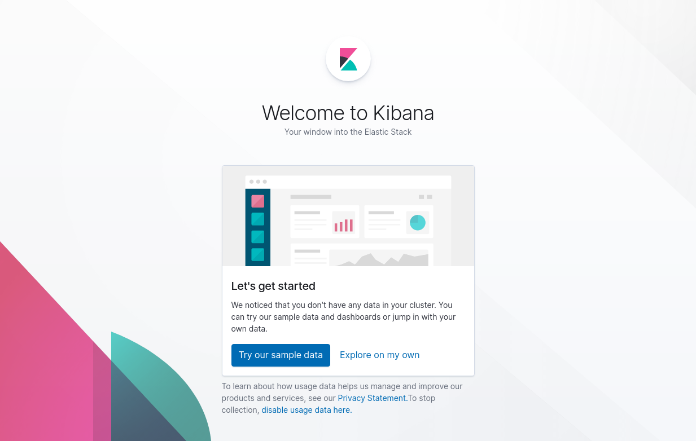
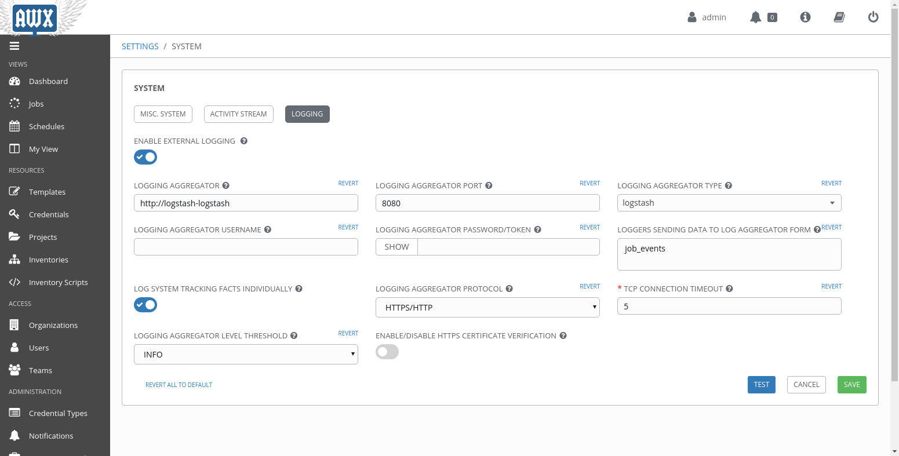
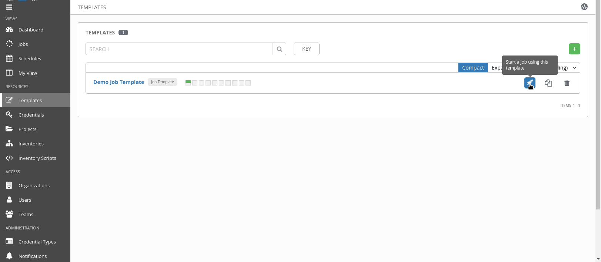
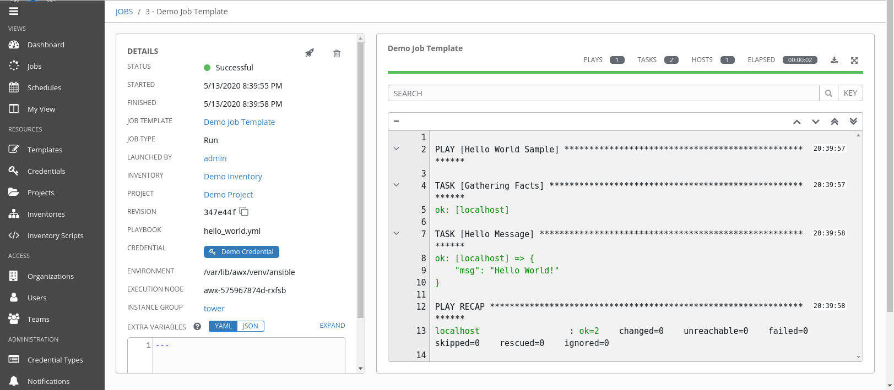
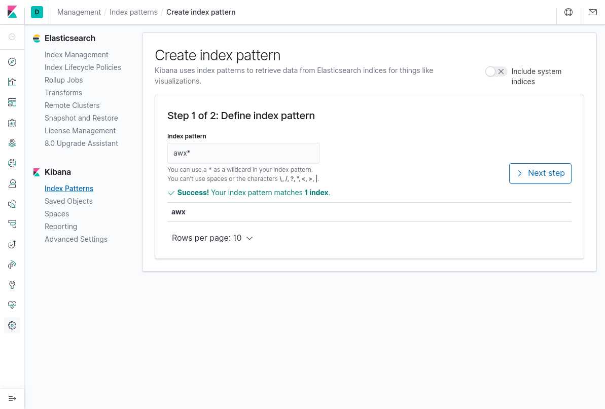
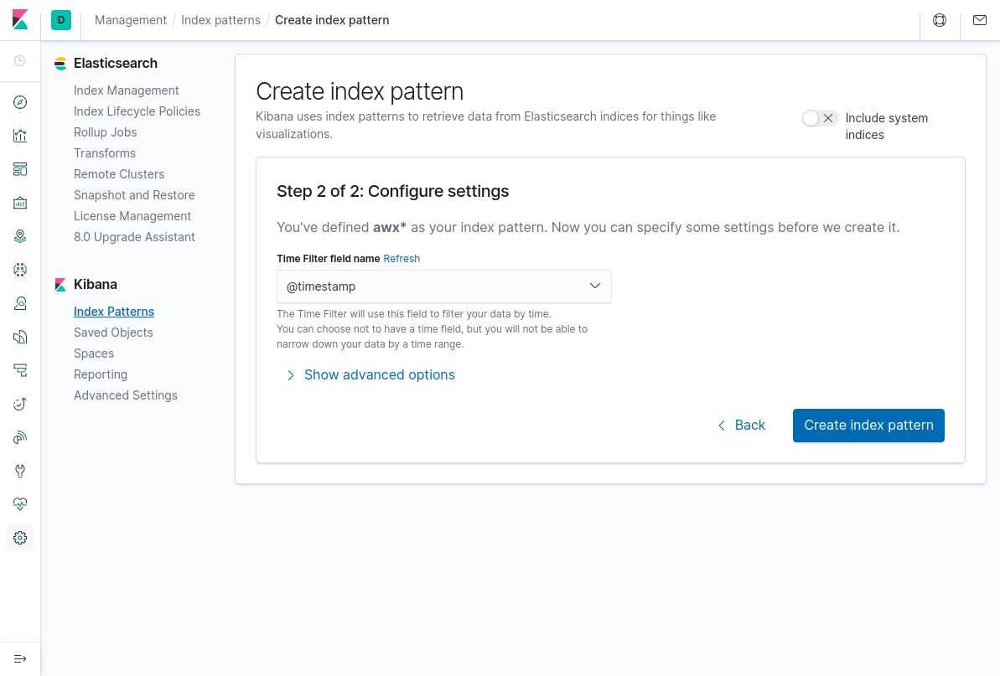
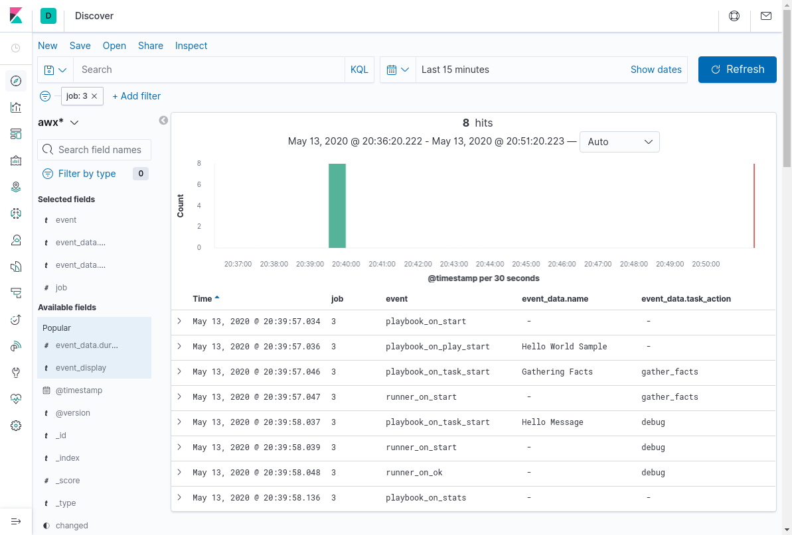

I love Kubernetes and Ansible. Both are some of the [10 most popular Open Source projects in github in 2019](https://insights.dice.com/2019/11/08/10-popular-open-source-projects-github/). That is why I wanted to give it a try to deploy ansible awx in kubernetes, along with an ELK stack (Elasticsearch, Logstash and Kibana), to store playbook information and create some nice dashboards.

There are several ways to extract information from AWX. You can see some of them if you prefer the ELK stack in the following picture.


We are exploring the solid line path, where awx sends through the external logger to ELK.

# Installation

First, we need to set up all the pieces.

## Kubernetes

A Solution Architect is like a Chef: selects the ingredients bearing in mind the final taste of the course. In this case, we need a base for our pizza, and kubernetes distribution is my favourite selection.

You can use whichever option you want, either managed or deployed by yourself. [Minikube](https://kubernetes.io/docs/tasks/tools/install-minikube/) or [Kind](https://kind.sigs.k8s.io/docs/user/quick-start/) are easy choices if you have a decent laptop and don’t want to spend too much on a first try.

I redirect to those pages to set up a kubernetes cluster if you want that option, with an ingress controller and a wildcard A DNS record for the ingress. From now on, I will assume you have a fully functional cluster to deploy on top of it. I will use a minikube for sample values, with the [ingress plugin (nginx)](https://kubernetes.io/docs/tasks/access-application-cluster/ingress-minikube/#enable-the-ingress-controller) deployed on it. I also use dnsmasq to set up a wildcard domain, I set up resolution __*.minikube.cloud__ for my minikube, but if you don’t know how to do it, I recommend using ingress-dns plugin.

## AWX

Now, clone the repo https://github.com/ansible/awx/, or download a release from https://github.com/ansible/awx/releases/. Go to the installer folder, where there is a playbook for installing awx on kubernetes or openshift. 

Then, you will have to set up different values in the **inventory**. The only property that needs to be changed is `kubernetes_context`. If you don’t know the cluster context, you can run `kubectl config get-contexts` to list them, or use `kubectl config current-context` to know your current one. 

```properties
kubernetes_context=minikube
```

You can go through all of them (some are for kubernetes, some for openshift and some for docker-compose). For example, the postgresql `pg_volume_capacity`, that defines volume capacity in GB.

```properties
pg_volume_capacity=1
```

And last but not least, I will configure the ingress hostname/annotations to set up the access to awx management console. In my case, I will use a name in my wildcard dns:

```properties
kubernetes_ingress_hostname=awx.minikube.cloud
```

Once the values are set, it is just to execute the ansible playbook to install awx:

```bash
ansible-playbook -i inventory install.yaml
```

After some time, you will have an awx instance up and running, to check it works, connect to the `<kubernetes_ingress_hostname>` with `<admin_user>/<admin_password>` credentials defined on your inventory.

## ELK

To deploy ELK stack on your kubernetes cluster, we will use the official helm charts from https://github.com/elastic/helm-charts. we clone that repository locally. 

### Elasticsearch

For elasticsearch, let’s just reduce the number of replicas and storage to fit in a small testing environment. Our custom `values.yaml` could be:

```yml
replicas: 1
minimumMasterNodes: 1

esConfig:
  elasticsearch.yml: |
    node.store.allow_mmap: false

volumeClaimTemplate:
  accessModes: [ "ReadWriteOnce" ]
  resources:
    requests:
      storage: 2Gi

ingress:
  enabled: true
  annotations: 
    kubernetes.io/ingress.class: nginx
  path: /
  hosts:
    - elasticsearch.minikube.cloud

sysctlInitContainer:
  enabled: false
```

Now, we can deploy our elasticsearch:

```bash
helm install elasticsearch <helm-charts>/elasticsearch -f values.yaml -n awx
```

After some time, if everything is ok, calling the ingress for elasticsearch you should get something like:

```json
{
  "name" : "elasticsearch-master-0",
  "cluster_name" : "elasticsearch",
  "cluster_uuid" : "qsz8ZKXcTBKf5QZE5ZHyew",
  "version" : {
    "number" : "7.6.2",
    "build_flavor" : "default",
    "build_type" : "docker",
    "build_hash" : "ef48eb35cf30adf4db14086e8aabd07ef6fb113f",
    "build_date" : "2020-03-26T06:34:37.794943Z",
    "build_snapshot" : false,
    "lucene_version" : "8.4.0",
    "minimum_wire_compatibility_version" : "6.8.0",
    "minimum_index_compatibility_version" : "6.0.0-beta1"
  },
  "tagline" : "You Know, for Search"
}
```

### Kibana

We can deploy a helm chart with the same approach as elasticsearch. I will only adapt the ingress hostname:

```yml
ingress:
  enabled: true
  annotations: 
    kubernetes.io/ingress.class: nginx
  path: /
  hosts:
    - kibana.minikube.cloud
```

As before we execute:

```bash
helm install kibana <helm-charts>/kibana  -f values.yaml -n awx
```

After that, when the kibana pod is healthy, we can see the initial screen.



### Logstash

We will use the same approach (helm) done with elasticsearch and kibana. We need to define the logstash pipeline that receives the messages and store them in elasticsearch.

```yml
logstashConfig: 
  logstash.yml: |
    http.host: 0.0.0.0
    xpack.monitoring.enabled: false

logstashPipeline: 
  logstash.conf: |
    input {
      http {}
    }
    filter {
      json {
        source => "message"
      }
    }
    output { 
      elasticsearch { 
        hosts => ["http://elasticsearch-master:9200"] 
        index => "awx" 
      } 
    }

service: 
  type: ClusterIP
  ports:
    - name: http
      port: 8080
      protocol: TCP
      targetPort: 8080

```

And then:

```bash
helm install logstash ~/git/helm-charts/logstash -f values.yaml -n awx
```

Once the pod is ready, we can now configure awx to use the external logging.

# Setup

## Configuring logstash external logger in AWX

The configuration is fairly simple, and [described in the product version of awx, ansible tower](https://docs.ansible.com/ansible-tower/latest/html/administration/logging.html). We will setup the logstash service, host http[]()://logstash-logstash, port 8080. There are five different loggers, for this example I will select job_events which tracks tasks in a job. I will also check log system tracking facts individually, so if a task is executed on several hosts, we will receive a log per host and not an aggregated one.



Click on test, and if everything is ok, you will receive a success, and then you can save the configuration.

# Test

## Run a sample playbook

AWX comes with a sample Hello World job template. For this demo, we will use it, but you can configure any other playbook to create some nice reports.

Let's execute this sample playbook:



When the run is complete, the output should be something like:



## See the results in Kibana

At this point, we have some data stored in elasticsearch with an auto created index called awx. We have to create a kibana index to explore the data:

Step 1:



Step 2:




Now, we are ready to play with the data. Remember to adapt the time window for the search to the one that is relevant. If the search gives no records, this is the first thing to check. An example query for the previous playbook run is shown in the following picture.



# Notes
1. AWX has moved to a syslog omhttp buffer-based remote sender on https://github.com/ansible/awx/pull/6108. Before that PR, the implementation was a fire & forget direct http connection to logstash.

3. Ansible stdout (not the output of the task) is stored in _stdout field. Not every record has this field.

2. Ansible message is parsed in logstash as a json tree. Some messages are plain text, that cannot be parsed as json, logstash will add "tags:_jsonparsefailure" to those messages, if no further preprocessing is done in logstash.

3. Json can include fields with invalid identifiers, (like “hostvars[inventory_hostname]”), that message will throw an exception at logstash and will only send the other fields in the message (like job number, etc). See previous note.

4. Some facts or custom-made messages can introduce fields, that even being valid in json format, are not valid for elasticsearch auto-indexing. An [example](https://discuss.elastic.co/t/storing-ansible-facts-in-elasticsearch-json-mapper-parsing-exception/68053/2) shown here, happens for example with version_info in python facts, that sometimes is like 

   "version_info": [ 3, 6, 8, "final", 0 ]

   Which is not valid for elastic, mixing long and string values. A good approach is pre-creating the index, with mapping rules that fixes those type issues.
