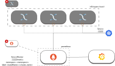
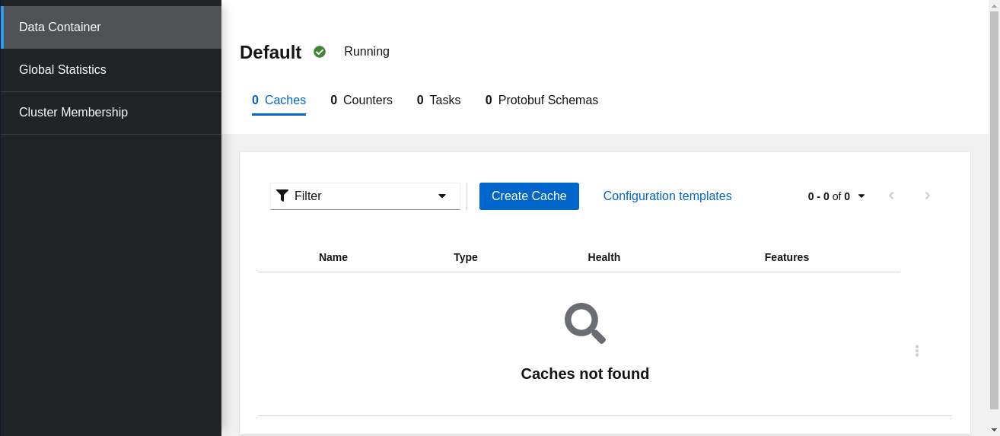
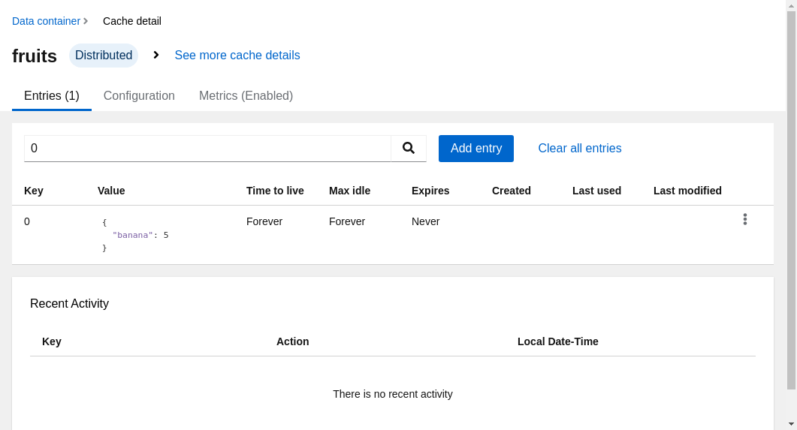
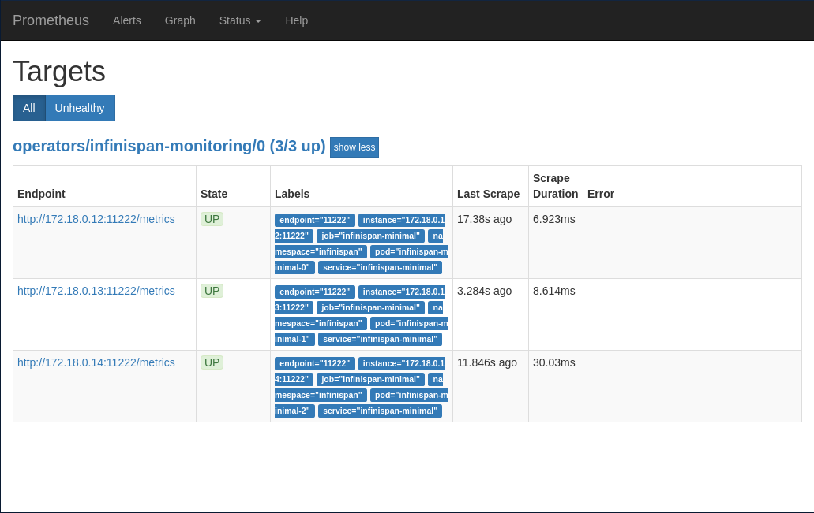
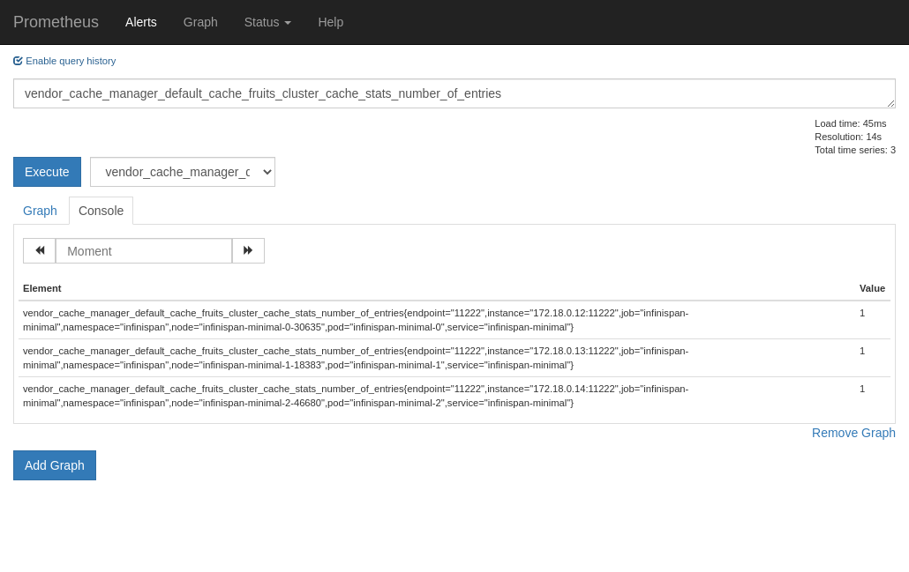
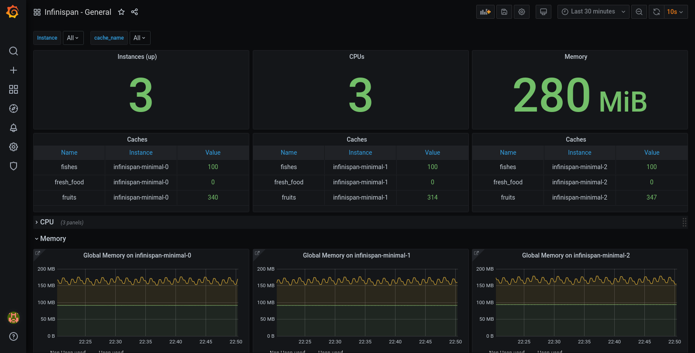

# Infinispan monitoring in Kubernetes with Prometheus and Grafana

[Infinispan](https://infinispan.org/) is a java based open source cache and grid solution, that is used extensively in different framework like j2ee, springboot and quarkus among others. It is compatible with different java caching models, like JSR-107 and spring data.

It is very simple to set up a high availability cluster with different replication/distribution configurations, and thanks to the kubernetes operator pattern, is even easier in kubernetes distribution.

[Prometheus](https://prometheus.io/) is the defacto standard for metric scraping and short-term storing to identify potential issues. It is a [graduated project](https://www.cncf.io/projects/) of the [CNCF Foundation](https://www.cncf.io).

[Grafana](https://github.com/grafana/grafana) is a very popular graphing tool that can create nice and easy to use dashboards, created and maintained by [Grafana Labs](https://grafana.com/).

We can see the architecture that we are going to test in the following picture.



## Kubernetes initial setup

For this example, I am going to use a minikube installation in my fedora, and for the dns I use a dnsmasq domain configuration, but the ingress-dns addon can be use indistinctly. The ingress dns wildard selected from now on will be `minikube.cloud`. My `dnsmasq.conf` (172.17.0.2 is from `minikube ip` command) is as follows.

```
address=/.minikube.cloud/172.17.0.2
``` 

## Deploying the Operator Lifecycle Manager

The Operator Lifecycle Manager (OLM) is part of an infrastructure that bundles an operator deployment, CRDs and dependencies (use to be RBAC objects) in a simple an easy way. [OperatorHub](http://operatorhub.io) 

At the time of writing this post, the current version is 0.15.1. To deploy it, just with a cluster-admin user, execute.

```bash
curl -sL https://github.com/operator-framework/operator-lifecycle-manager/releases/download/0.15.1/install.sh | bash -s 0.15.1
```

Or just execute `minikube addons enable olm`.

## Deploying an Infinipan Cluster

We are using the kubernetes operator. To deploy it, just create an [infinispan-operator.yaml](code/infinispan/infinispan-operator.yaml) with the following content (from now on, replace infinispan namespace if any other is selected for this test).

```yml
apiVersion: v1
kind: Namespace
metadata:
  name: infinispan
---
apiVersion: operators.coreos.com/v1
kind: OperatorGroup
metadata:
  name: operatorgroup
  namespace: infinispan
spec:
  targetNamespaces:
  - infinispan
---
apiVersion: operators.coreos.com/v1alpha1
kind: Subscription
metadata:
  name: infinispan
  namespace: infinispan
spec:
  channel: dev-preview
  name: infinispan
  source: operatorhubio-catalog
  sourceNamespace: olm
```

## Deploying a cluster using the operator

The process described here is based on the official documentation for deploying the operator: [infinispan operator documentation](https://infinispan.org/infinispan-operator/master/operator.html). If anything else is needed, refer to that documentation as a reference.

The infinispan operator ensures the cluster to be secured at least with credentials. We are setting our own ones, but if you prefer the operator to create a random ones, just don't set up the secret and it will be automatically populated in the deployment.

The broker credentials are structured using [identities.yaml](code/infinispan/identities.yaml).

```yml
credentials:
- username: developer
  password: dIRs5cAAsHIeeRIL
- username: operator
  password: uMBo9CmEdEduYk24
```

Once this file is created, we need to encode in base 64.

```bash
cat identities.yaml | base64 -w 0
```

And then, we can create the secret with these credentials, and the infinispan Custom Resource (CR) instance to create the cluster. Create a file called [infinispan-cluster.yaml](code/infinispan/infinispan-cluster.yaml).

```yml
apiVersion: v1
kind: Secret
metadata:
  name: infinispan-basic-auth
  namespace: infinispan
data:
  identities.yaml: Y3JlZGVudGlhbHM6Ci0gdXNlcm5hbWU6IGRldmVsb3BlcgogIHBhc3N3b3JkOiBkSVJzNWNBQXNISWVlUklMCi0gdXNlcm5hbWU6IG9wZXJhdG9yCiAgcGFzc3dvcmQ6IHVNQm85Q21FZEVkdVlrMjQK
---
apiVersion: infinispan.org/v1
kind: Infinispan
metadata:
  name: infinispan-minimal
  namespace: infinispan
spec:
  image: infinispan/server:11.0
  replicas: 3
  service:
    type: DataGrid
  security:
    endpointSecretName: infinispan-basic-auth
```

```bash
kubectl create -f infinispan-cluster.yaml -n infinispan
```


To check the identities are ok, or recover them in the future, we can execute.

```bash
kubectl get secret infinispan-basic-auth -o jsonpath="{.data.identities\.yaml}" | base64 -d
```

I recommend using hotrod protocol to communicate from clients to servers, as it is optimized for achieving the best performance. For example, clients keep topology updated for faster store/retrieval in case of distributed caches. However, to simplify this example, I am going to use the REST interface. I can do with containers inside kubernetes, or expose through load balancers or nodeports defined in the operator. As I am used to create ingresses for that, I will do the same. Create a file called [infinispan-ingress.yaml](code/infinispan/infinispan-ingress.yaml).

```yml
apiVersion: networking.k8s.io/v1beta1
kind: Ingress
metadata:
  name: infinispan-minimal
  namespace: infinispan
  annotations: 
    kubernetes.io/ingress.class: nginx
    nginx.ingress.kubernetes.io/affinity: cookie
spec:
  rules:
    - host: infinispan-minimal.minikube.cloud
      http:
        paths:
          - path: /
            backend:
              serviceName: infinispan-minimal
              servicePort: 11222
```

And create the ingress based on that file.

```bash
kubectl create -f infinispan-ingress.yaml
```

To double check if the cluster is up and running, you may execute some [API REST commands](https://infinispan.org/docs/dev/titles/rest/rest.html).

```bash
curl -X GET -u developer:dIRs5cAAsHIeeRIL -H "Content-Type: application/json" http://infinispan-minimal.minikube.cloud/rest/v2/server
```
The result should be the version details.

```json
{"version":"Infinispan 'Corona Extra' 11.0.0.Final"}
```

Or you can go to http://infinispan-minimal.minikube.cloud/console/, and with the credentials above, you will see the infinispan console.



## Creating a Cache and adding some data

After deploying the cluster, infinispan has no caches configured (but some internal ones, defined with `__name__`). We are creating a sample cache named "fruit", with the following configuration in [default.json](code/data/default-distributed.json).

```json
{
    "distributed-cache": {
        "mode": "SYNC",
        "owners": 1,
        "partition-handling": {
            "when-split": "ALLOW_READ_WRITES",
            "merge-policy": "REMOVE_ALL"
        },
        "transaction": {
            "mode": "NONE"
        },
        "memory": {
            "off-heap": {
                "size": 96468992,
                "eviction": "MEMORY",
                "strategy": "REMOVE"
            }
        },
        "statistics": true
    }
}
```

Then, create the cache.

```bash
curl -X POST -u developer:dIRs5cAAsHIeeRIL -H "Content-Type: application/json" http://infinispan-minimal.minikube.cloud/rest/v2/caches/fruits --data-binary "@default.json"
```
We can query the cache list.

```bash
curl -X GET -u developer:dIRs5cAAsHIeeRIL -H "Content-Type: application/json" http://infinispan-minimal.minikube.cloud/rest/v2/caches/
```
You can get some output like this.

```json
["___protobuf_metadata","fruits","___script_cache"]
```

We can add some records to the cache, for example.

```bash
curl -X POST -u developer:dIRs5cAAsHIeeRIL -H "Content-Type: application/json" http://infinispan-minimal.minikube.cloud/rest/v2/caches/fruits/0 --data '{ "banana": 5 }'
```

And query the API or just go to the console and see if this entry is there.



## Prometheus Server

There are different alternatives to deploy and configure a prometheus server and its rules to scrape the targets. I am selecting to use the coreos operator, as it can be used with olm as I did previously with infinispan.

As it is installed cluster-wide, the target namespace `operators` is already set up by the olm installation. We only need one file, [prometheus-operator.yaml](code/prometheus/prometheus-operator.yaml) (you may use https://operatorhub.io/install/prometheus.yaml if you prefer, but I like to change the name from `my-prometheus` to `infinispan-prometheus`).

```yml
apiVersion: operators.coreos.com/v1alpha1
kind: Subscription
metadata:
  name: infinispan-prometheus
  namespace: operators
spec:
  channel: beta
  name: prometheus
  source: operatorhubio-catalog
  sourceNamespace: olm
```

```bash
kubectl create -f prometheus-operator.yaml
```

Now, we need to create a prometheus instance to scrape our infinispan metrics.

```yml
apiVersion: monitoring.coreos.com/v1
kind: Prometheus
metadata:
  labels:
    prometheus: k8s
  name: infinispan
  namespace: operators
spec:
  alerting: 
    alertmanagers: []
  replicas: 1
  ruleSelector: {}
  securityContext: {}
  serviceAccountName: prometheus-k8s
  serviceMonitorSelector: {}

```

Good! Now we create a ServiceMonitor for our Infinispan cluster. We need also to add the credentials to access the secured endpoint. Just create a file called [prometheus-service-monitor.yaml](code/prometheus/prometheus-service-monitor.yaml) with the following content.

```yml
apiVersion: v1
stringData:
  username: developer 
  password: dIRs5cAAsHIeeRIL 
kind: Secret
metadata:
  name: prom-infinispan-basic-auth
  namespace: operators
type: Opaque
---
apiVersion: monitoring.coreos.com/v1
kind: ServiceMonitor
metadata:
  labels:
    k8s-app: prometheus
  name: infinispan-monitoring
  namespace: operators
spec:
  endpoints:
    - basicAuth:
        password:
          key: password
          name: prom-infinispan-basic-auth
        username:
          key: username
          name: prom-infinispan-basic-auth
      interval: 30s
      scheme: http
      targetPort: 11222
  namespaceSelector:
    matchNames:
      - infinispan
  selector:
    matchLabels:
      app: infinispan-service
      clusterName: infinispan-minimal
```

And create the objects in the cluster.

```bash
kubectl create -f prometheus-service-monitor.yaml
```

I recommend to create an ingress to the prometheus server, so we can check if the endpoints are correctly scraped and we are getting all the metrics that we want. With the following [prometheus-ingress.yaml](code/prometheus/prometheus-ingress.yaml).

```yml
apiVersion: networking.k8s.io/v1beta1
kind: Ingress
metadata:
  name: prometheus
  namespace: operators
  annotations: 
    kubernetes.io/ingress.class: nginx
spec:
  rules:
    - host: prometheus.minikube.cloud
      http:
        paths:
          - path: /
            backend:
              serviceName: prometheus-operated
              servicePort: web
```

And creating it.

```bash
kubectl create -f prometheus-ingress.yaml
```

So you should see the targets like in the following picture.



And then, you can try and query a metric from the new cache.



## Grafana

To deploy Grafana on kubernetes cluster, we will use the official helm charts from. We can add the repo to helm, or just use the remote bundle. We are using a [values.yaml](code/grafana/values.yaml)

```bash
helm install infinispan-grafana grafana -f values.yaml --repo https://kubernetes-charts.storage.googleapis.com 
```

With this values, you get the prometheus datasource already configured. You may create your own dashboard, or just import this two samples that I created, a [General](code/grafana/Infinispan-11-General.json) and a [Detailed](code/grafana/Infinispan-11-CacheStatistics.json) templated for a cache.

The General dashboard with this setup can be something like the following picture.



## Code

All the code used in this post can be downloaded at [this github repo](https://github.com/gordillo-ramon/blog/tree/master/content/post/2020-06_Infinispan_monitoring_in_Kubernetes/code).