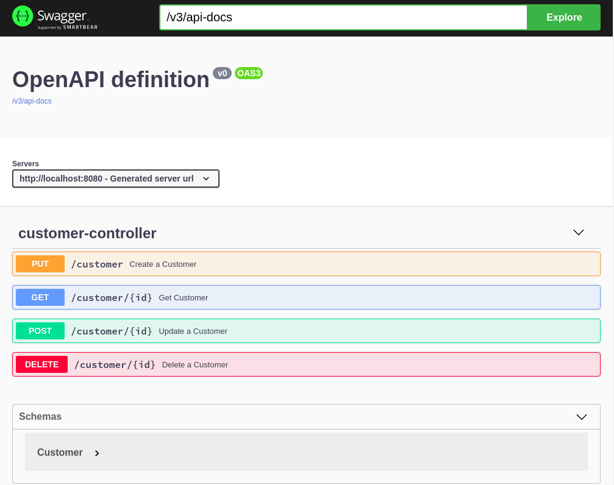
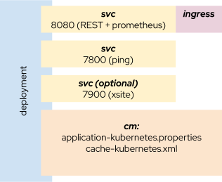

Springboot is extensively used for microservice architectures, most of them running in kubernetes. Spring Cache has been defined as an abstraction layer for cache servers, although there are other alternatives (JSR-107 JCache was one of the initial ones).

When using a cache, there are two alternatives, embedded in the microservice or external to it. Both has its benefits and drawbacks and depending on the use case one is prefered to the other.

In this article, I am trying to give a simple example (the easiest I have achieved) for an embedded cache with infinispan. I will show how to create a simple microservice replicated, that uses an embedded cache, how to create the kubernetes objects to deploy it and how to add the monitoring bits including the cache statistics.

## From zero to hero, the easiest path
As a brief summary, the libraries I will use are:
- infinispan
- lombok
- spring-docs
- spring-boot-actuator
- spring-cache
- jkube

All of them are pretty simple to add to your project, and provide automatically useful features to make your microservice as simple as possible.

Although I am copying some code snippets here to explain the process, if you want to give it a try by yourself I recommend cloning [the repo]().

## Developing the microservice

## Maven file
For this example, I will use maven, but the same can be implemented with graddle.
These are the artifacts that should be added in [pom.xml]() for start developing the code:

- org.infinispan:**infinispan-spring-boot-starter-embedded**: this should be the first one to avoid spring boot bringing its own dependency versions (which are not correlated with the starter)
- org.springframework.boot:**spring-boot-starter-web**: Main Spring Boot framework
- org.projectlombok:**lombok**: Automatically setters/getters/constructors for my POJOs
- org.springdoc:**springdoc-openapi-ui**: To create OpenAPI (previously known as swagger) web for easy testing.
- org.springframework.boot:**spring-boot-starter-actuator**: expose the health check, and prometheus metrics automatically on Spring Boot applications.
- io.micrometer:**micrometer-registry-prometheus**: adds infinispan openmetrics to the prometheus endpoint.
- org.springframework.cloud:**spring-cloud-starter-kubernetes**: To provide automatically configuration and refresh from Kubernetes ConfigMaps/Secrets (among other features)


### POJO
First, we should define the java object to serialize. I will use lombok annotations to create the setters/getters, and spring-docs for giving some context to the OpenAPI auto generated documentation [Customer.java]().

```java
@Getter @Setter @NoArgsConstructor 
@Schema(title = "Customer")
@JsonPropertyOrder({"id","first-name","last-name","email"})
public class Customer implements Serializable {

	@Schema(title="UUID of a customer", readOnly=true )
	@JsonProperty("id")
	private String id;
	
	@Schema(title="First Name" )
	@JsonProperty("first-name")
	private String firstName;
	
	@Schema(title="Last Name" )
	@JsonProperty("last-name")
    private String lastName;
	
	@Schema(title="Email" )
	@JsonProperty("email")
    private String email;
    	
}
```

### Spring Cache Repository
A simple repository can be created with the following code [CustomerRepositorySpringCache.java]():

```java
@Repository
@Qualifier("SpringCache") 
@CacheConfig(cacheNames="customers")
public class CustomerRepositorySpringCache {

    @Cacheable(key="#id")
    public Customer findById(String id){
    	return null; 	
    }

    @CachePut(key="#id")
    public Customer insert(String id, Customer c){
        return c;
    }
    
    @CacheEvict(key="#id")
    public void delete(String id){
    }
}
```
It selects the spring-cache qualifier to be implemented. You can use also JCache with slight differences in the annotations, at the moment of writing this article, you can see them on [this link](https://docs.spring.io/spring-framework/docs/current/reference/html/integration.html#cache-jsr-107) of the official spring documentation.

I may have configured the cache name ("customers") to come from application.properties, but I have prefered to keep it simple, as the name of the object was already selected.

### Rest Controller
The last part is implementing a REST spring controller. I am only showing in this snippet the PUT method, all the code is in [CustomerController.java]() 
```java
    @RequestMapping(method=RequestMethod.PUT,value="/customer")
    @Operation(
            summary = "Create a Customer",
            description = "Create a Customer serialized in JSON")
    public Customer putCustomer(
            @Parameter(description = "Customer object", required = true, name = "Customer") 
            @RequestBody Customer c
    		) {
    	
    	c.setId(UUID.randomUUID().toString());
    	
        return repository.insert(c.getId(), c);
    }
```
Each method is annotated with REST mappings and spring-docs annotations to expose the OpenAPI with more details.

### Launcher
You only need to add a Spring Boot application class like [CustomerServiceCacheApplication.java](). 

```java
@SpringBootApplication
@EnableCaching
public class CustomerServiceCacheApplication {
	
	static Logger logger = LoggerFactory.getLogger(CustomerServiceCacheApplication.class);
	
	public static void main(String[] args) {
        try {
		SpringApplication.run(CustomerServiceCacheApplication.class, args);
        } catch (Exception e){
        	logger.error("Exception in main: ", e);
        }
	}
	
}
```
Note the @EnableCaching annotation. that injects the cache in the microservice automatically, and depending on the dependencies and configuration, it selects one particular implementation.

### Configuring everything
First step for an usual developer is to test it on his own laptop (It works on my machine ¯\_(ツ)_/¯). So I have created an application.properties with simple configuration, which does not use anything from kubernetes.

Essentially, I have configured:

```properties
management.endpoints.web.exposure.include=health, prometheus
```

To expose health and prometheus endpoints, and the infinispan properties for embedded configuration:

```properties
infinispan.embedded.enabled=true
infinispan.embedded.clusterName=local
infinispan.embedded.configXml=cache-local.xml
```

Next step needed is adding the cache-local.xml, that provides the cache definition for "customers":

```xml
<infinispan>
  <cache-container statistics="true">
    <local-cache name="customers" statistics="true"/>
  </cache-container>
</infinispan>
```

I have enabled the statistics in both, the cache container and the cache, so both are exposed through micrometer on the prometheus endpoint.

## Local Testing

First thing to check, running the microservice with:

```bash
mvn clean package spring-boot:run
```

If everything has been ok, you should see the under [The OpenAPI localhost UI](http://localhost:8080/swagger-ui.html) the following console:



Good, Let's check the prometheus endpoint is also up and running and exposing the cache metrics with:

```bash
> curl -s http://localhost:8080/actuator/prometheus |grep "cacheManager"
cache_puts_total{cache="customers",cacheManager="springEmbedded",name="customers",} 0.0
cache_evictions_total{cache="customers",cacheManager="springEmbedded",name="customers",} 0.0
cache_size{cache="customers",cacheManager="springEmbedded",name="customers",} 0.0
cache_gets_total{cache="customers",cacheManager="springEmbedded",name="customers",result="hit",} 0.0
cache_gets_total{cache="customers",cacheManager="springEmbedded",name="customers",result="miss",} 0.0
cache_gets_latency_MILLISECONDS{cache="customers",cacheManager="springEmbedded",name="customers",} 0.0
cache_start_SECONDS{cache="customers",cacheManager="springEmbedded",name="customers",} 641.0
cache_memory_size{cache="customers",cacheManager="springEmbedded",name="customers",} 0.0
cache_memory_offHeap{cache="customers",cacheManager="springEmbedded",name="customers",} 0.0
cache_puts_latency_MILLISECONDS{cache="customers",cacheManager="springEmbedded",name="customers",} 0.0
cache_reset_SECONDS{cache="customers",cacheManager="springEmbedded",name="customers",} 641.0
cache_removes_latency_MILLISECONDS{cache="customers",cacheManager="springEmbedded",name="customers",} 0.0
```

Good, everything works fine. The final test is using the OpenAPI UI or sending direct requests to the endpoints, to create some values and retrieve them. I recommend the UI as it is easier for a first try, although for unit testing it is prefered to call directly the endpoints.

## Kubernetes and multiples instances


Now we are starting the interesting things. We will use jkube to build the image and create all the artifacts needed (configMap, deployment, services, ingress, roles and rolebindings).

For building the image, I will use the [jkube binary java image](https://github.com/jkubeio/jkube-images#jkube-java-binary-s2i), but if you prefer to use buildpacks, you may comment on [this issue](https://github.com/eclipse/jkube/issues/439) to give your ideas.

If you want to build it and push to your docker registry, modify the pom.xml with the image and registry that you want to store it and execute

```bash
mvn clean package k8s:build k8s:push
```

Or if you want to test it in minikube, an easy way is to do the following (if you use other profile, use the -p in the minikube command):

```bash
eval $(minikube docker-env)
mvn clean package k8s:build
```

And it will store directly the image in the docker storage of your minikube instance.

The main artifacts are defined in this picture



Additionally, to use spring-cloud-kubernetes, the microservice has to be able to query for configmaps and secrets on the namespace it is deployed (or any other if we configure that way, although it is not usual), so a role/rolebinding and a serviceaccount for this purpose is also created:

```yml
apiVersion: v1
kind: ServiceAccount
metadata:
  name: customer-service-cache
---
apiVersion: rbac.authorization.k8s.io/v1
kind: Role
metadata:
  name: customer-service-cache
rules:
  - apiGroups: [""]
    resources: ["configmaps", "pods", "services", "endpoints", "secrets"]
    verbs: ["get", "list", "watch"]
---
apiVersion: rbac.authorization.k8s.io/v1
kind: RoleBinding
metadata:
  name: customer-service-cache
roleRef:
  kind: Role
  apiGroup: ""
  name: customer-service-cache
subjects:
- kind: ServiceAccount
  apiGroup: ""
  name: customer-service-cache
```

The main difference with the configuration in the local mode is the multi-instance coordination based on jgroups. That means that the only difference in `application.properties` is:

```properties
infinispan.embedded.configXml=/opt/jboss/etc/cache-kubernetes.xml
```

That is, now it is using the folder where the configMap is mounted to select a new cache configuration specific for kubernetes and multi replica. The `cache-kubernetes.xml` is as follows:

```xml
<infinispan>
  <cache-container statistics="true">
    <transport stack="kubernetes" />
    <serialization marshaller="org.infinispan.commons.marshall.JavaSerializationMarshaller">
      <allow-list>
        <regex>.*</regex>
      </allow-list>
    </serialization>
    <replicated-cache name="customers" statistics="true" />
  </cache-container>
</infinispan>

```

Some notes from this configuration:
- The cache type has been set as replicated. Distributed can also be used, but local one will keep the objects local to the particular replica and it will not create a global cluster.
- I have added the `transport` element that select kubernetes default discovery protocol for the cluster, based on DNS_PING, which retrieves the endpoints for the service that should be configured using the system property `jgroups.dns.query`
- The marshaller between replicas is based on the JavaSerialization and the allow-list has been configured for allowing all classes. The recommended marshaller is protobuf, but I wanted to keep the code as simple as possible. For more information on marshallers, see [this document](https://infinispan.org/docs/stable/titles/developing/developing.html#marshalling).

With all this configuration, it is now easy to deploy everything.

If you completed the image build step, and 

```bash
mvn clean package k8s:resource k8s:deploy
```

As jkube will take the KUBECONFIG context from your shell, remember to set it up before running the maven goal.

If you are going to develop something similar, remember you may create maven profiles with goals that provide the steps in an orderly way, so it will be more error prone in your CI/CD.

In case something is not working as expected, or you want to do the cleaning in the namespace, you can just use

```bash
mvn clean package k8s:resource k8s:undeploy
```

By the way, jkube has also the ability of creating helm charts from your code. But this is another story.