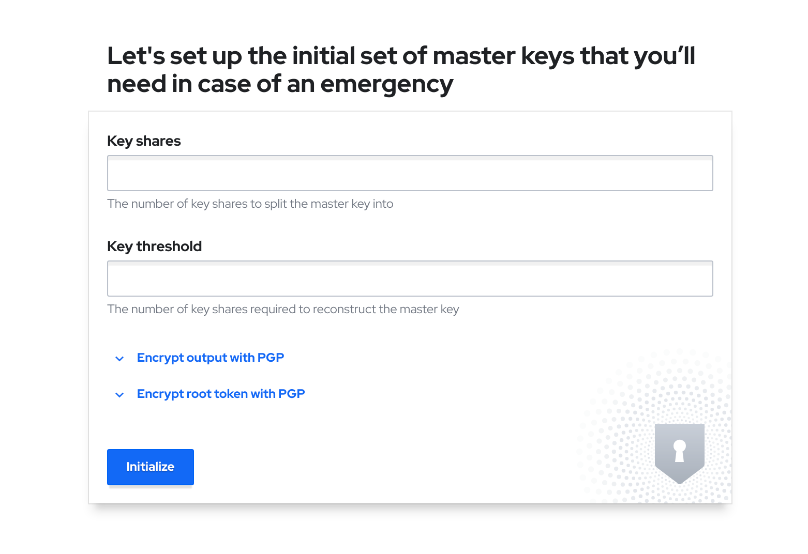
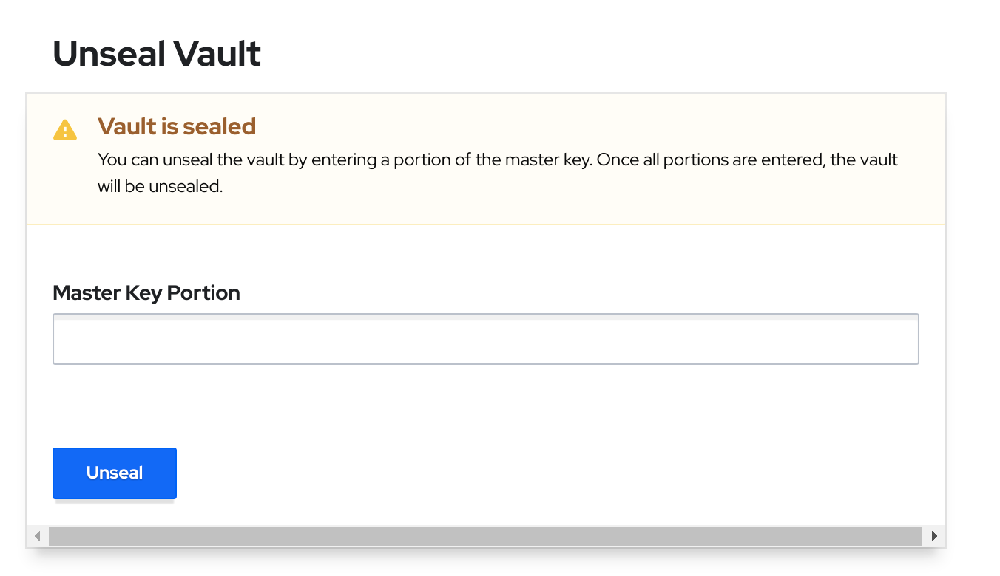
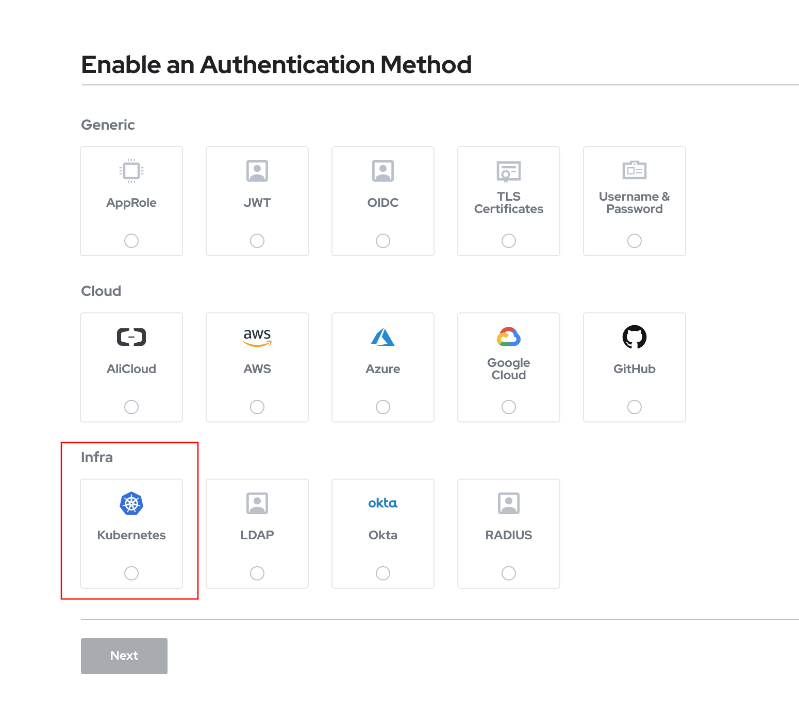

Last month I was picking my brain about GitOps and how this model fits with other kubernetes technologies like operators and backups. I decided to give it a try with ArgoCD. I created a private repo on GitHub, and started to set up everything. Suddenly, a thought came into my mind: I cannot store sensible information in a GitHub repo even if it is private and for testing purposes. So I started to dig into the alternatives using the [links in the documentation](https://argoproj.github.io/argo-cd/operator-manual/secret-management/).

I discarded some cloud-only solutions like aws-secret-operator, and also some that only covers one deployment type like helm secrets or kustomize secret generator plugins. Looking for help, my colleague [Mario Vazquez](https://github.com/mvazquezc) suggested that it would be better if we can even avoid storing encrypted secrets in the repo and allow us to distribute different credentials for the vault in different clusters. So I decided to go in my first try for [Hashicorp Vault](https://www.vaultproject.io/) and use their open source version that can be deployed in kubernetes too.

The easier way to integrate a new feature like secret injection in ArgoCD is through plugins. [This project](https://github.com/IBM/argocd-vault-plugin) can be used for this purpose, so it will be the base for our integration.

# Deployment and Configuration

## Prerequisites

As usual in my posts, I start with a kubernetes development cluster, using minikube, with my ingress domain `minikube.cloud`. My test does not seem to need too many resources, so beginning with 4 CPUs and 8 Gb RAM is more than enough for a start.

```bash
minikube start --cpus=4 --memory=8192Mb --driver=kvm2 --addons dashboard,ingress,metrics-server
```

For ingresses, my preference is to use [ssl passthrough](https://kubernetes.github.io/ingress-nginx/user-guide/tls/#ssl-passthrough). Thanks to [Manuel Alejandro de Brito](https://github.com/aledbf) for [this hint](https://github.com/kubernetes/ingress-nginx/issues/6722#issuecomment-754597194), it is really simple to patch the nginx that comes with minikube.

```bash
kubectl patch deployment \
  ingress-nginx-controller \
  --namespace kube-system \
  --type='json' \
  -p='[{"op": "add", "path": "/spec/template/spec/containers/0/args/-", "value": "--enable-ssl-passthrough"}]'
```

And to check if it is applied, wait for the pod to be ready and use.

```bash
kubectl exec -n kube-system $(k get pods -n kube-system -o name |grep ingress-nginx-controller) -- cat nginx.conf |grep is_ssl
```

which should return `is_ssl_passthrough_enabled = true,`. Don't forget if you shutdown minikube instance, you will need to execute again the former command after start up.

You will also need some tools, [helm cli](https://helm.sh/docs/intro/install/) for deploying the vault, [argocd cli](https://argoproj.github.io/argo-cd/cli_installation/), [vault cli](https://releases.hashicorp.com/vault/) and a git repository for connecting ArgoCD and storing the sample data.

## ArgoCD

### Installing and configuring the vault plugin

The choices available to use plugins in ArgoCD container images are two, either using an init container to download and install it before running the main container or building a custom image. Although the first method is simpler from a development point of view, it seems [it is not supported yet](https://github.com/argoproj-labs/argocd-operator/issues/204) using the operator, which will be our prefered deployment choice in next section, so we are building a custom image easily with the following dockerfile with minor changes from the [doc](https://github.com/IBM/argocd-vault-plugin#custom-image).

```dockerfile
FROM argoproj/argocd:v1.8.7

# Switch to root for the ability to perform install
USER root

# Install tools needed for your repo-server to retrieve & decrypt secrets, render manifests
# (e.g. curl, awscli, gpg, sops)
RUN apt-get update && \
    apt-get install -y \
        curl \
        awscli \
        gpg && \
    apt-get clean && \
    rm -rf /var/lib/apt/lists/* /tmp/* /var/tmp/*

# Install the AVP plugin (as root so we can copy to /usr/local/bin)
RUN curl -L -o argocd-vault-plugin https://github.com/IBM/argocd-vault-plugin/releases/download/v0.6.0/argocd-vault-plugin_0.6.0_linux_amd64
RUN chmod +x argocd-vault-plugin
RUN mv argocd-vault-plugin /usr/local/bin

# Switch back to non-root user
USER argocd
```

If you are tempted not to push it to a container registry like dockerhub or quay.io and use some of the tricks in [minikube docs](https://minikube.sigs.k8s.io/docs/handbook/pushing/) for local caching, don't waste your time, because argocd-repo-server deployed through the operator uses an image pull policy of `Always`, which means it will contact the repo every time to check for the image and download it if there is any difference. We still can use the registry addon plugin if you wish, but I decided for simplicity to upload it to quay.io.

### Deployment

There are different alternatives to deploy ArgoCD, whether directly through objects, with helm or using the operator. My prefered way uses to be using an operator through [Operator Lifecycle Manager](https://github.com/operator-framework/operator-lifecycle-manager), and that will be the way I did it using the [official documentation](https://argocd-operator.readthedocs.io/en/latest/install/olm/).

First, installing the olm, which I used to do this way:

```bash
curl -sL https://github.com/operator-framework/operator-lifecycle-manager/releases/download/v0.17.0/install.sh | bash -s v0.17.0
```

Then, we deploy the operator using [argocd-operator.yaml](code/argocd/argocd-operator.yaml). At the moment of writing this post, the last version is 0.14, but it is [estimated](https://github.com/argoproj-labs/argocd-operator/issues/256) that a new version arrive at the end of March.

```bash
kubectl create -f argocd-operator.yaml
kubectl wait --for condition=established --timeout=60s crd/argocds.argoproj.io
```

Then, we create the ArgoCD server using a custom resouce defined in [argocd-server.yaml](code/argocd/argocd-server.yaml). Remember to use your container image built in [the previous process](#installing-and-configuring-the-vault-plugin).

```bash
kubectl create -f argocd-server.yaml -n argocd
```

This is a very basic configuration. For keeping as simple as possible, I have left the monitoring, HA, etc, out of the picture, but if you are interested, a reference of configuration for the custom resource is available [here](https://argocd-operator.readthedocs.io/en/latest/reference/argocd/). We will explain all the pieces of this configuration during this post. First of all, the server ingress. 

```yml
spec:
  server:
    host: argocd.minikube.cloud
    ingress:
      enabled: true
      annotations:
        kubernetes.io/ingress.class: nginx
        nginx.ingress.kubernetes.io/force-ssl-redirect: "true"
        nginx.ingress.kubernetes.io/ssl-passthrough: "true"
```

We are also setting up a the configManagementPlugins in the operator as defined in [the doc](https://argocd-operator.readthedocs.io/en/latest/reference/argocd/#config-management-plugins), using the reference from the [plugin doc](https://github.com/IBM/argocd-vault-plugin#installing-in-argocd).

```yml
spec:
  configManagementPlugins: |
    - name: argocd-vault-plugin
      generate:
        command: ["argocd-vault-plugin"]
        args: ["-s", "argocd-vault-plugin-credentials", "generate", "./"]
    - name: argocd-vault-plugin-helm
      generate:
        command: ["sh", "-c"]
        args: ["helm template . > all.yaml && argocd-vault-plugin -s argocd-vault-plugin-credentials generate all.yaml"]
    - name: argocd-vault-plugin-kustomize
      generate:
        command: ["sh", "-c"]
        args: ["kustomize build . > all.yaml && argocd-vault-plugin -s argocd-vault-plugin-credentials generate all.yaml"]
```

And at the end, to be able to use the serviceaccount in the plugin, we need:

```yml
spec:
  repo:
    mountsatoken: true
```

If you look at the previous commands, it references `-s argocd-vault-plugin-credentials`. It is the way to tell the plugin about the environment variables to connect to the vault and use the authentication that we will configure in the [vault section](#configure-the-plugin-authentication).

To connect to the ui, following [this doc](https://argocd-operator.readthedocs.io/en/latest/usage/basics/#secrets), the admin password is created by the operator.

```bash
ARGOCD_ADMIN_PASSWORD=$(kubectl -n argocd get secret argocd-cluster -o jsonpath='{.data.admin\.password}' | base64 -d)
argocd login argocd.minikube.cloud --username admin --password ${ARGOCD_ADMIN_PASSWORD} --insecure
```

If you want to connect to the UI, just do an `echo {ARGOCD_ADMIN_PASSWORD}` and use it as password to the `admin` user.

## Vault

### Deployment

Our first task is to deploy and configure the vault. Looking at the [helm chart](https://github.com/hashicorp/vault-helm), there is a dev mode, but the comment "all data is lost on restart" discouraged me on trying it. So I go for the easiest configuration that is persisted. There are several docs about using the chart, like [this](https://www.vaultproject.io/docs/platform/k8s/helm), but I prefer to go directly to the former official repo. First, I will add the hashicorp heml repo as suggested in the official documentation.

```bash
helm repo add hashicorp https://helm.releases.hashicorp.com
```

Digging a little bit in the chart, I find out that there is an UI that can be enabled. I decided to see also what it is like, so I changed the default params a little bit. I will install in its own namespace, let't say `vault`.

```bash
kubectl create namespace vault

helm install vault hashicorp/vault --namespace vault --set ui.enabled=true --set server.ingress.enabled=true --set server.ingress.hosts[0].host=vault.minikube.cloud
```

After a while it creates a StatefulSet with one replica called `vault-0` and some other objects. Conecting to the console, shows the following.



Wait! Is it not available yet?

That's the point. Before banging our heads against the wall, I will try to explain what happens, sorry if I say something not 100% accurate, as it is just my understanding in plain words.

To use the vault you have to do some steps, and using it for ArgoCD you need some extra ones. When the vault is deployed with helm, only the infra is deployed, but not configured. You can follow [this guide](https://learn.hashicorp.com/tutorials/vault/kubernetes-minikube?in=vault/kubernetes), but without the need to use consul and 3 replicas.

Let me try to explain the process. First step you need to do with a hashicorp vault is [init](https://www.vaultproject.io/docs/commands/operator/init) it. That can be done through API or command line. This process will create the key shares to unseal it and the root token. In a real environment, you may share different keys among different people (like the two keys for the missile silos you can see in Wargames film), but for a simple dev environment, one key is more than enough.

Once we have initiated the vault, we have the keys and the root token. What else? To access the vault, we have to [unseal](https://www.vaultproject.io/docs/commands/operator/unseal) it with the keys. It is a pretty straigthforward operation that can be done through the command line or with the UI.



Let's see how we can do it using the cli. Set up the right url and let it to bypass cert checks (which obviously should be enforced in a shared environment):

```bash
export VAULT_ADDR=https://vault.minikube.cloud
export VAULT_SKIP_VERIFY=true
```

Then, execute this simple chain of commands.

```bash
OUTPUT=/tmp/output.txt

vault operator init -n 1 -t 1 >> ${OUTPUT?}

unseal=$(cat ${OUTPUT?} | grep "Unseal Key 1:" | sed -e "s/Unseal Key 1: //g")
root=$(cat ${OUTPUT?} | grep "Initial Root Token:" | sed -e "s/Initial Root Token: //g")

vault operator unseal ${unseal?}

vault login -no-print ${root?}
```

Remember to store the seal key and root token, otherwise if the vault is sealed again (for example, because of a restart), you will lose all the configuration in the vault and need to redeploy everything on the vault.

We have now a vault operative to the second step, configuring for the ArgoCD plugin.

### Configure the plugin authentication

Once it is unsealed, we don't want to use the root token for apps to authenticate against the vault, we need to create an authentication method. There are plenty of them, but the plugin for ArgoCD supports at the moment of writing this post only AppRole, Github and Kubernetes. The option for me is obvious, let's try the kubernetes first!

To configure that, first we need to [enable](https://www.vaultproject.io/docs/commands/auth/enable) this authentication to be used. Same as with other actions, can be done through the command line or in the UI.



As we are going to use the argocd service account to authenticate with that provider, we need the token that is in that service account. We can get it with the following command.

```bash
vault auth enable kubernetes

token_reviewer_jwt=$(kubectl get secrets -n argocd -o jsonpath="{.items[?(@.metadata.annotations.kubernetes\.io/service-account\.name=='default')].data.token}" |base64 -d)

kubernetes_host=$(kubectl get service -n default kubernetes -o jsonpath="{.spec.clusterIP}")

kubectl cp -n vault vault-0:/var/run/secrets/kubernetes.io/serviceaccount/..data/ca.crt /tmp/ca.crt

vault write auth/kubernetes/config \
   token_reviewer_jwt="${token_reviewer_jwt}" \
   kubernetes_host=https://${kubernetes_host}:443 \
   kubernetes_ca_cert=@/tmp/ca.crt

vault write auth/kubernetes/role/argocd \
    bound_service_account_names=default \
    bound_service_account_namespaces=argocd \
    policies=argocd \
    ttl=1h
```

For the vault to use the default argocd namespace service account to authenticate, it is needed that this serviceaccount has cluster privileges over tokenreviews as mentioned in [the doc](https://www.vaultproject.io/docs/auth/kubernetes#configuring-kubernetes).

I just created the [argocd-cluster-permissions.yaml](code/argocd/argocd-cluster-permissions.yaml) to grant those permissions with the following command.

```bash
kubectl create -f argocd-cluster-permissions.yaml
```

Now it is just a matter of creating a configmap where storing the configuration details for the ArgoCD plugin. This is the [configmap](code/argocd/argocd-vault-plugin-credentials.yaml).

```yml
kind: Secret
apiVersion: v1
metadata:
  name: argocd-vault-plugin-credentials
  namespace: argocd
type: Opaque
stringData:
  AVP_VAULT_ADDR: http://vault.vault.svc:8200
  AVP_TYPE: vault
  AUTH_TYPE: k8s
  K8S_ROLE: argocd
```

And we create it through the following.

```bash
kubectl create -f argocd-vault-plugin-credentials.yaml
```

### Configure the values for secret substitution
We have everything to be used by the plugin. Now we need to set up a KV secret engine and the paths/value needed for the substitution. Here we show an example for illustration about the process.

First, create the KV secret engine and the policies for accessing it. The policy is the one defined in [argocd-policy.hcl](code/argocd/argocd-policy.hcl)

```bash
vault secrets enable -path avp -version=2 kv
vault policy write argocd argocd-policy.hcl
```

Now we can define our first property.

```bash
vault kv put avp/example/example-auth password=changeme
```

Now we need the final step, configuring ArgoCD to use the plugin to substitute the credentials when synchronizing the repos.

# Test the complete solution

We are just doing a very simple test to check everything is working as expected. We need a git repo to store a simple secret, in our case we are using the following one.

```yml
apiVersion: v1
kind: Secret
metadata:
  name: auth
  annotations:
    avp_path: avp/data/example/example-auth
type: Opaque
stringData:
  username: Administrator
  password: <password>
```

Look at the secret annotation. It references the path, but as commented in [this link](https://www.vaultproject.io/docs/secrets/kv/kv-v2#acl-rules), paths are prefixed with "data" after the root name.

As we are using the operator, it is very simple to create a project and an application. First, we can start with a project, or you may afterwards create the applications on the default one, just for testing. We can use [argocd-project.yaml](code/argocd/argocd-project.yaml)

```yml
apiVersion: argoproj.io/v1alpha1
kind: AppProject
metadata:
  name: example
spec:
  description: Blog example project
  clusterResourceWhitelist:
  - group: '*'
    kind: '*'
  destinations:
  - namespace: '*'
    server: '*'
  sourceRepos:
  - '*'
```

We create the ArgoCD project.

```bash
kubectl create -f argocd-project.yaml -n argocd
```

And check the project is created.

```bash
argocd proj list
NAME               DESCRIPTION           DESTINATIONS  SOURCES  CLUSTER-RESOURCE-WHITELIST  NAMESPACE-RESOURCE-BLACKLIST  SIGNATURE-KEYS  ORPHANED-RESOURCES
default                                  *,*           *        */*                         <none>                        <none>          disabled
example            Blog example project  *,*           *        */*                         <none>                        <none>          disabled
```

Now we create the application linked to that project. Same situation, with a CRs for that, like [argocd-application-example.yaml](code/argocd/argocd-application-example.yaml). This example requires a public repo, if you want to use a private one, have a look at defining [initialRepositories](https://argocd-operator.readthedocs.io/en/latest/reference/argocd/#initial-repositories) through the operator.

```yml
apiVersion: argoproj.io/v1alpha1
kind: Application
metadata:
  name: argocd-application-example
spec:
  destination:
    name: in-cluster
    namespace: demo
  project: example
  source:
    path: <your-git-path>
    repoURL: <your-public-git-repo>
  syncPolicy:
    automated:
      selfHeal: true
```

If everything is correct, after the sync though ArgoCD, 

```bash
kubectl get secret auth -n demo -o yaml
```

Will return

```yml
apiVersion: v1
kind: Secret
metadata:
  name: auth
  annotations:
    avp_path: avp/data/example/example-auth
type: Opaque
stringData:
  username: Administrator
  password: changeme
```

# Conclusion

Storing sensitive data in git repos is not a valid choice in almost any deployments. Depending on the level of trust of your kubernetes infrastructure, you can set up the secret management at gitops sync time like the one we have shown in this post, or use the integration with the vault at runtime. 