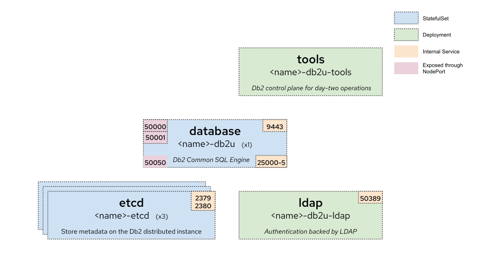
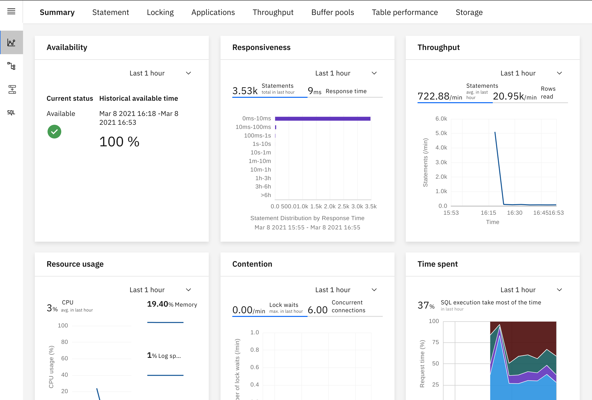
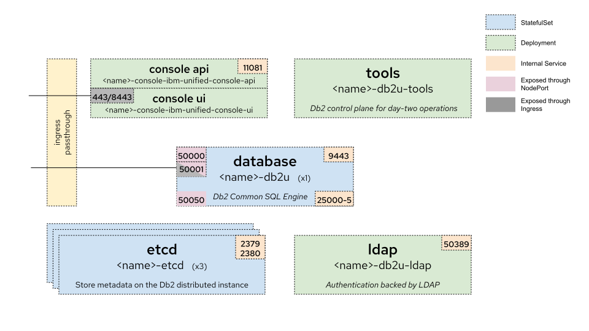
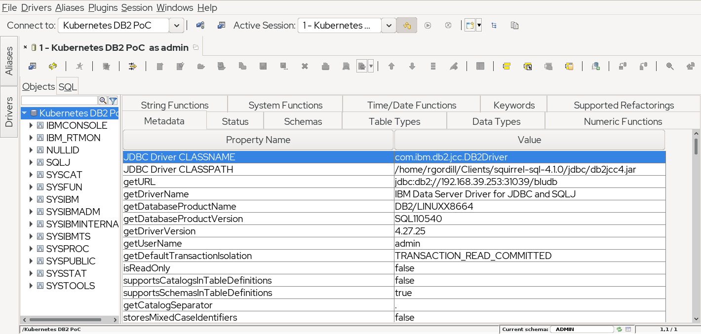

Recently I have been asked a lot of similar questions like "does it make sense to invest in deploying legacy technology on kubernetes?". 

Well, first of all, I have to say that some technologies that are considered "legacy" have tons of new exciting features for the new workloads and applications. This is, for example, the case of DB2 with spatial queries and many others that you may have a look at (to be honest, I have very few experience with it).

Secondly, not all the applications are greenfield. There are lots of old ones that are using those "legacy" technologies. Even some greenfield ones need to use data stored in long life systems. If I want to modernize those applications or build new ones based on these data, I should be able to develop in a friendly environment. And as a developer, I would be more than happy if I can create an instance where I have total control and that I can reuse the agility of containers.

That is why I was tempted to try DB2 on containers. I was looking at an alternative to do as quickly as possible, so that is why I took some decisions that maybe do not follow exactly the guidelines that I would link as a reference.

# Disclaimer 
This is just a personal exercise, it does not represent IBM procedures or recommendations in any way. DB2® is copyright by IBM, every time I refer to DB2 it should be assumed implicitly DB2®. It is not an open source technology under different licences by IBM, in this case I would use the community edition, whose license and other details are commented [in this official blog](https://www.ibm.com/cloud/blog/announcements/ibm-db2-developer-community-edition).

I would like to mention that is **only** an exercise. Please, use the recommended, documented and supported procedure if you need an stable version for your particular use case.

Additionally we should remember db2 technology as most of the traditional databases, uses low level access to some resources (like shared memory, processes, and so on) to perform best on bare metal/virtual environments. That means it **still** [requires those privileges](https://www.ibm.com/support/knowledgecenter/SSEPGG_11.5.0/com.ibm.db2.luw.db2u_openshift.doc/doc/db2_os_security.html), and although they are working on adapting better to cloud and containers, we are not used to see them in container native technologies.

# Prerequisites

## Kubernetes

As I have done in previous posts, I am using minikube for this exercise and a local domain served by dnsmasq on my laptop. That provides me the ability of working offline once the container images are deployed on the cluster.

In my test I have used a configuration or 6 cpus and 12 Gb of RAM, as suggested in [CPU requirements](https://github.com/IBM/charts/tree/master/stable/ibm-db2#resources-required). If we are not deploying the Unified Console, we can reduce it to 4 cpus.

I used the following command (check your driver):

```bash
minikube start --cpus=6 --memory=12288 --driver=kvm2 --addons dashboard,ingress,metrics-server
```

Additionally, in some steps we will need some ingress objects with passthrough ssl. That will simplify to provide SNI negotiation. To [configure the nginx controller for ssl passthough](https://kubernetes.github.io/ingress-nginx/user-guide/tls/#ssl-passthrough), review the deployment and add the `--enable-ssl-passthrough` arguments to the container ones.

## IBM API Key

You should register in IBM as a developer, and create an API key. I have used the console using [this procedure](https://cloud.ibm.com/docs/account?topic=account-userapikey#create_user_key).

# Deployment

I have modified a couple of things from the documentation I have found and linked, the most relevant are:

- Use helm 3 instead of helm 2, because after November 2020 [helm 2 is officially deprecated](https://helm.sh/blog/helm-v2-deprecation-timeline/). 
- In vanilla kubernetes for developers, we don't need to worry about [Security Context Constraints](https://docs.openshift.com/container-platform/4.7/authentication/managing-security-context-constraints.html), which provides an extra security to OpenShift environments. As our dev cluster is in a laptop, I can relax a little bit the security requirements (note: if the environment is shared, review the security or consider alternatives to avoid bad times).

## Preparation

First, clone the repo https://github.com/IBM/charts. Go to `stable/ibm-db2` folder, where there you can find most of the artifacts and information to deploy db2 community edition on OpenShift. 
 
We are now creating the namespace for deploying the database. We are creating a service account and provide the privileges through a role and a role binding to create some additional objects, as the helm chart will deploy some jobs to create the whole infrastructure on the namespace.

```bash
kubectl create namespace db2

kubectl create serviceaccount db2u -n db2
kubectl create -f ibm_cloud_pak/pak_extensions/pre-install/namespaceAdministration/ibm-db2-role.yaml -n db2
kubectl create -f ibm_cloud_pak/pak_extensions/pre-install/namespaceAdministration/ibm-db2-rb.yaml -n db2
```

Then, as we will use a private registry (the ibm one), we need to set up the credentials for it. With the API Key that you should have obtained in the prerequisites, create a secret and add it to the service account to allow pulling the images needed for the deployment.

```bash
kubectl create secret -n db2 docker-registry ibm-registry \
   --docker-server=icr.io \
   --docker-username=iamapikey \
   --docker-password=<api_key>

kubectl patch serviceaccount db2u -n db2 -p '{"imagePullSecrets": [{"name": "ibm-registry"}]}'
```

We are now ready to deploy the database.

## Deployment

The official deployment script is `db2u-install` on the ibm_cloud_pak/pak_extensions/common folder. It encapsulates the helm 2 script, so I have done a little hack in order to use helm 3 and avoid using tiller.

Also, I wanted to get the secrets created automatically, so I need to change `generateSecrets=true` that is false in the original script. With all those changes, we can create the jobs that will deploy all the infra, executing the helm command from `stable/ibm-db2` folder.

```bash
helm install db2poc $PWD --namespace db2 --values $PWD/values.yaml --set arch=x86_64 --set servicename=db2poc --set ldap.ldap_server=db2poc-db2u-ldap --set global.dbType=db2oltp --set database.name=BLUDB --set generateSecrets=true --set storage.storageClassName=standard --set storage.useDynamicProvisioning=true
```

And voilá, after downloading images, and creating everything,we have a brand new db2 instance in our kuberenets cluster. We are going to do some additional tests to double check everything is ok.

In the following picture, we can see the main architecture for the deployment. 



## Creating a developer user

From [this doc](https://www.ibm.com/support/producthub/db2/docs/content/SSEPGG_11.5.0/com.ibm.db2.luw.db2u_openshift.doc/doc/db2_os_crtnoncp4duser.html), we have some hints on how to create an user on the ldap that this db2 instance uses as identity provider.

```bash
tools_pod=$(kubectl get po -n db2 -o name | grep db2poc-db2u-tools)
kubectl exec -it ${tools_pod} -- addLdapUser.py -u admin -p h4ck1t -r admin
```
We will get something like
```
Next UID will be 5003
Adding admin to LDAP server
Updating LDAP password for user admin
Added user to LDAP server
```

After creating the user on the ldap, we check it is valid for use as db2 user:

```bash
kubectl exec -it db2poc-db2u-0 -- id admin
kubectl exec -it db2poc-db2u-0 -- su db2inst1 -c "~/sqllib/bin/db2 connect to bludb user admin using h4ck1t"
```

If everything is ok, we will get
```
uid=5003(admin) gid=3000(bluadmin) groups=3000(bluadmin)

   Database Connection Information

 Database server        = DB2/LINUXX8664 11.5.4.0
 SQL authorization ID   = ADMIN
 Local database alias   = BLUDB
```

# Optional: Unified console
The instructions to deploy the unified console in the same namespace as the db2 instance are explaine in [this doc](https://github.com/IBM/charts/tree/master/stable/ibm-unified-console). Like previously, we prefer to use helm 3, so instead of using `deploy-console.sh` script, we are running directly the helm command.

From the root path of your github clone, move to the `stable/ibm-unified-console` folder. Then, run the following command.

```bash
helm install db2poc-console $PWD --set configMapName=db2poc-db2u-uc-config --set dataServer.ldap.rootPwdSecretName=db2poc-db2u-ldap --set dataServer.metadb.pwdSecretName=db2poc-db2u-instance --set dataServer.sharedPVC.name=db2poc-db2u-sqllib-shared --set global.image.secretName=ibm-registry -f $PWD/ibm_cloud_pak/pak_extensions/values-standalone-console.yaml --namespace db2
```

After deploying the chart, an additional ingress is needed. The `deploy-console.sh` creates the route object for OpenShift, a similar command for vanilla kubernetes ingress on nginx whould be:

```bash
cat << _EOF_ |kubectl apply -f -
apiVersion: networking.k8s.io/v1
kind: Ingress
metadata:
  name: db2poc-console
  namespace: db2
  annotations:
    kubernetes.io/ingress.class: nginx
    nginx.ingress.kubernetes.io/ssl-passthrough: "true"
spec:
  rules:
  - host: db2poc-console.db2.minikube.cloud
    http:
     paths:
      - backend:
          service:
            name: db2poc-console-ibm-unified-console-ui
            port:
              number: 443
        path: /
        pathType: ImplementationSpecific
_EOF_
```

If everything is right, you may login into the ingress host (in my case, https://db2poc-console.db2.minikube.cloud) with the user credentials you have created previously and see a picture like the following.



The whole architecture including the unified console now is as depicted.



# Testing
The chart deploys a nodeport service to access the database connecting through plain and ssl ports. We are going to do some initial tests based on it, but we are going to set up an ingress to use ssl passthrough to connect from outside the cluster.

I am testing the connection using [Squirrel](http://squirrel-sql.sourceforge.net/), which is under [GNU Lesser General Public License](http://www.gnu.org/licenses/licenses.html#LGPL). These instructions will be similar to other jdbc-based database tools.

At the time of writing this post, I have used the 11.5.4 client jdbc driver that can be downloaded from [IBM Support](https://www.ibm.com/support/pages/node/387577). As a reference, I use the document [IBM Data Server Driver for JDBC and SQLJ type 4 connectivity URL syntax](https://www.ibm.com/support/knowledgecenter/en/SSEPEK_11.0.0/java/src/tpc/imjcc_r0052342.html) for setting up the connection.

```bash
echo "Minikube IP is" $(minikube ip)
echo "Non-secure NodePort is" $(kubectl get service db2poc-db2u-engn-svc -o jsonpath='{.spec.ports[?(@.name=="legacy-server")].nodePort}' )
```

Bearing in mind the default database is bludb, we add the alias `jdbc:db2://<minikube_ip>:<nodeport>/bludb` to connect, and get a successful session through the unsecure nodeport.



I usually prefer to connect through a ssl passthrough ingress to the database from outside. A nodeport is ok, but has some drawbacks. If you want to try the ingress option, it is as simple as creating it with:

```bash
cat << _EOF_ |kubectl apply -f -
apiVersion: networking.k8s.io/v1
kind: Ingress
metadata:
  name: db2poc-db2u
  namespace: db2
  annotations:
    kubernetes.io/ingress.class: nginx
    nginx.ingress.kubernetes.io/ssl-passthrough: "true"
spec:
  rules:
  - host: "db2poc-db2u.minikube.cloud"
    http:
     paths:
      - backend:
          service:
            name: db2poc-db2u
            port:
              number: 50001
        path: /
        pathType: ImplementationSpecific
_EOF_
```

Now, you need the cert chain to add to the jdbc properties. You can extract the CA and the certificate connecting with openssl to the secured ingress connection, in my case using the following.

```bash
echo -n | openssl s_client -connect db2poc-db2u.minikube.cloud:443 -servername db2poc-db2u.minikube.cloud -showcerts 2>/dev/null |sed -ne '/-BEGIN CERTIFICATE-/,/-END CERTIFICATE-/p' > /tmp/certs.pem
```

In order to double check, the cert subject should be:

`CN=ibm.com,OU=ICP,O=IBM,L=Toronto,ST=Ontario,C=CA`
`CN=ibm.com,OU=db2ssl,O=IBM,L=Toronto,ST=Ontario,C=CA`

You need to add those certs to a java keystore (jks). We can do it through the command line with keytool or use a visual tool like [Keystore Explorer](https://keystore-explorer.org/). Once you have the jks, you only need to add that information to the jdbc. A brief and useful [guide](https://www.ibm.com/support/pages/complete-guide-set-ssl-using-ibm-data-server-driver-jdbc-and-sqlj) can help you through the parameters. An example of secured url through the ingress is `jdbc:db2://db2poc-db2u.minikube.cloud:443/bludb:sslConnection=true;sslTrustStoreLocation=/tmp/db2-server.jks;sslTrustStorePassword=h4ck1t;`. Don't forget the semicolon at the end of the url!

# More information
Other than the previous links and their related pages, you may find some useful information about the architecture, sizing, etc, for a production deployment on OpenShift in [IBM Db2 Warehouse MPP on Red Hat
OpenShift Container Storage](https://www.redhat.com/rhdc/managed-files/is-ibm-db2-warehouse-mpp-on-openshift-container-storage-detail-f24114pr-202006-en.pdf)