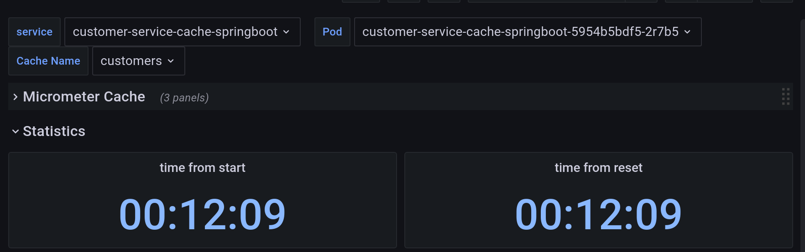
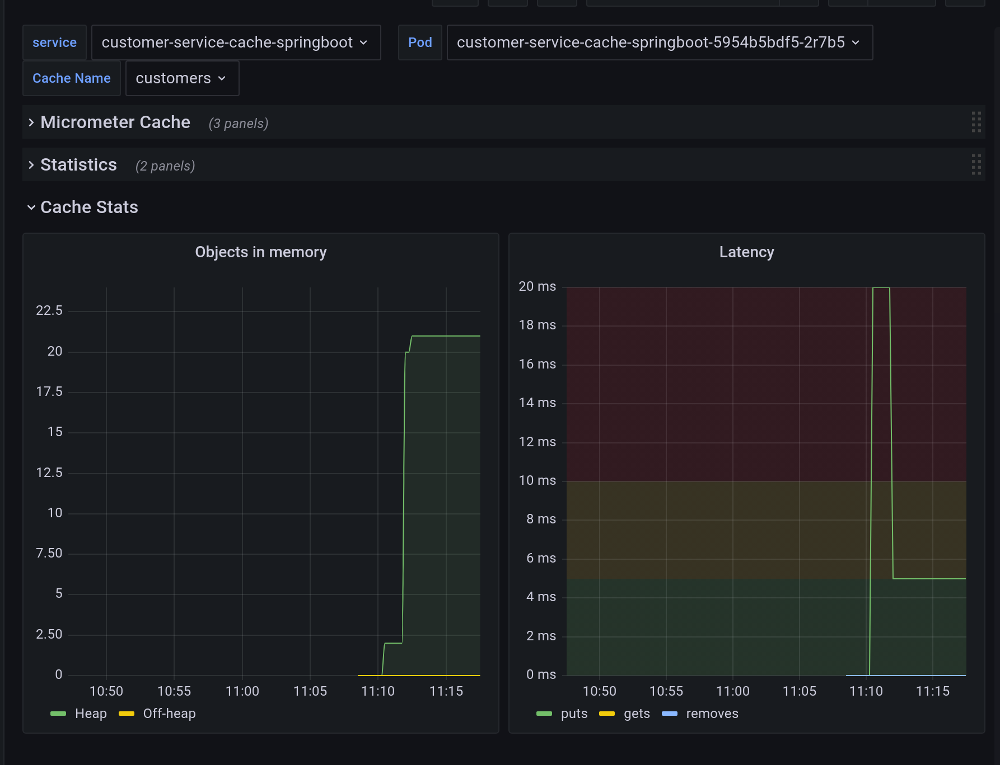

In [previous article](https://blog.ramon-gordillo.dev/2020/12/spring-boot-embedded-cache-with-infinispan-in-kubernetes/), we explanined how to develop a microservice in SpringBoot that uses infinispan as spring-cache implementation. We exposed the actuator prometheus endpoint to check in our local environment that it was running right. In this post, we are going to use the actuator endpoint to scrape it with prometheus and create a grafana dashboard to monitor the performance.

## Initial Set Up in kubernetes

We assume that we have our microservice already deployed on your kubernetes namespace. From now on, in our examples, we will use the namespace `customers`. 

### Prometheus

We need a prometheus server to scrape the metrics. At that point, there are several alternatives for this task. In another [post](https://blog.ramon-gordillo.dev/2020/06/infinispan-monitoring-in-kubernetes-with-prometheus-and-grafana/) about how to deploy and monitor infinispan servers, I used prometheus operator to do the set up.

However, that is an usual approach if you have cluster-admin rights, or you already have the prometheus operator deployed, as installing CRDs requires those privileges.

If you are in this situation, go ahead and use a ServiceMonitor, as it is the easiest approach. However, if you are not able to use the operator, I will give you an alternative at this point.

I took the helm chart from [this project](https://github.com/prometheus-community/helm-charts/tree/main/charts/prometheus). You can select the version you need. Even this helm chart is usually meant for creating ClusterRole and ClusterRoleBindings. However, if we select `rbac.create=false` and `server.useExistingClusterRoleName=false`, it will use a serviceAccount without extra privileges. So you can add those by creating a Role and RoleBinding (not cluster) on your namespace.

You need also to configure the rules for scrapping the actuator endpoint. I include an [example with ServiceMonitor](code/prometheus/prometheus-service-monitor.yaml) and also an example of [values.yaml](code/prometheus/values.yaml) where the infinispan monitoring has been set up for namespace `customers` using the field `extraScrapeConfigs`.

To deploy on namespace `customers` without cluster-admin privileges, just do:

```bash
helm install prometheus prometheus-community/prometheus -n customers -f values.yaml
```

### Grafana

We deploy grafana with the same procedure as in this previous post. However, as time goes by, I have updated the image version to 8.1.2.

Now that we have the datasource created by the dashboard (review the endpoint of your prometheus server if you are not using `customers` namespace), we can import the dashboards. I have updated [this dashboard](https://grafana.com/grafana/dashboards/10280) with the latest changes of the SpringBoot version I am using, removed the HikariCP panel and updated charts to latest (and greatest) version of grafana. I am providing it in case you want to reuse or take it as a base for your own [SpringBoot Dashboard](code/grafana/Spring-Boot-Statistics.json).

You only need to import the dashboard and assign the prometheus datasource. Similar to that, I have developed a very simple one for infinispan with the same structure. If you prefer, you may combine both into only one with the infinispan part as a panel. This is my example of [Infinispan Embedded dashboard](code/grafana/Infinispan-Embedded.json).

## Looking at the metrics and dashboard

Micrometer defines a [set of metrics](https://micrometer.io/docs/ref/cache) that are supposed to be [implemented by all cache implementations and and additional way of extending those metrics](https://www.javadoc.io/doc/io.micrometer/micrometer-core/latest/io/micrometer/core/instrument/binder/cache/CacheMeterBinder.html) . 

Mapping from internal metrics to micrometer ones is done in [this binder](https://github.com/infinispan/infinispan/blob/main/spring/spring-boot/embedded/src/main/java/org/infinispan/spring/starter/embedded/actuator/InfinispanCacheMeterBinder.java). We are grouping metrics to show the common and the particular ones.

The dashboard is split into a set of panels. First panel is related to general cache metrics as defined with micrometer.


Second one is about cache statistics: when cache was started and when statistics have been reset.



And last one is related to performance in the caches. Memory usage and time that takes to do operations in the cache are shown.


