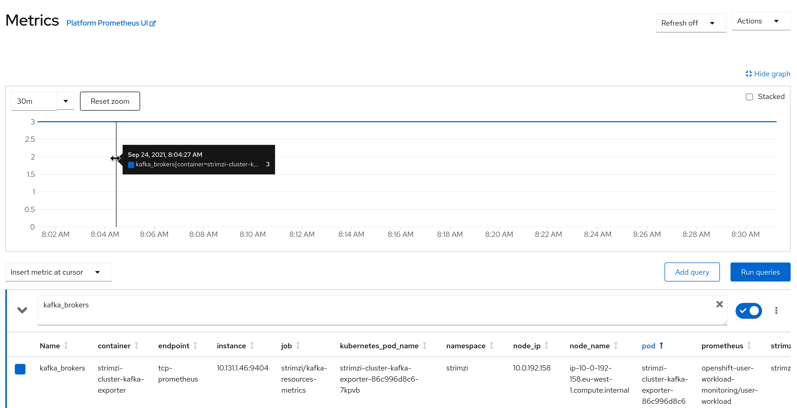
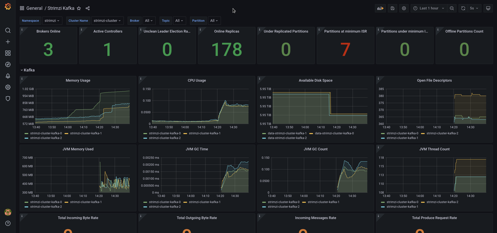
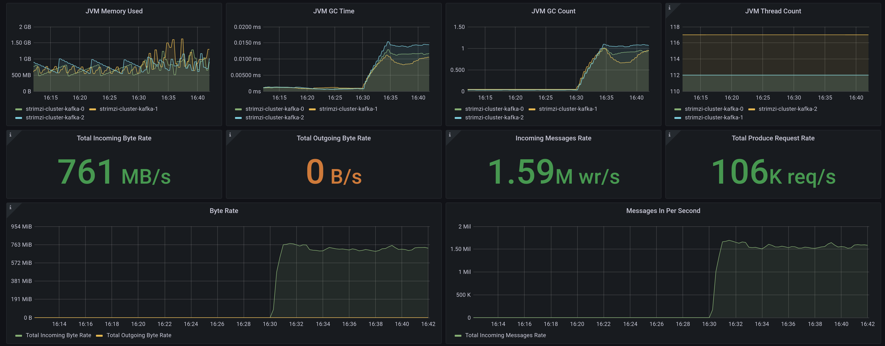
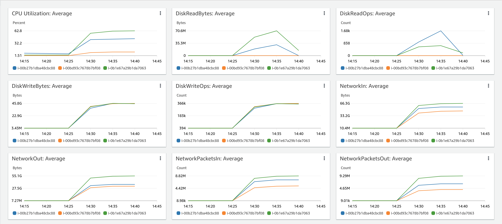
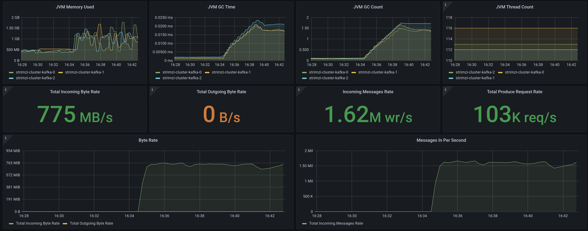
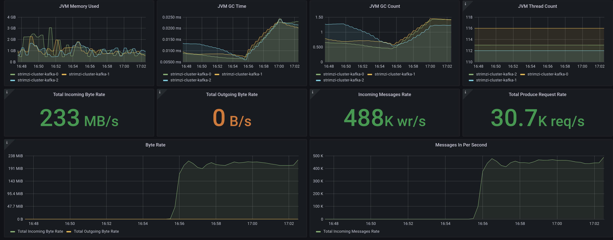
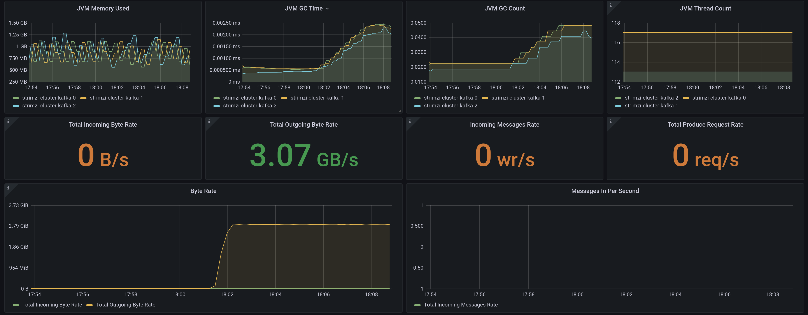
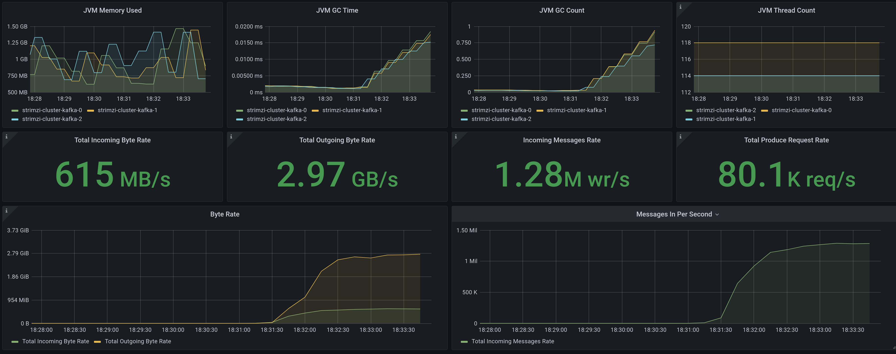

It has been ages since I was introduced in Apache Kafka and read the post from linkedin [Benchmarking Apache Kafka: 2 Million Writes Per Second (On Three Cheap Machines)](https://engineering.linkedin.com/kafka/benchmarking-apache-kafka-2-million-writes-second-three-cheap-machines). At that time, the post wanted to show why the new messaging platform fitted the linkedin use cases with better performance than other traditional brokers.

Now that new kubernetes workloads are on the picture and it is fairly simple to deploy a kafka cluster using operators like [strimzi](https://strimzi.io/), I was tempted to try to repeat the scenarios from the original post in a kubernetes cluster. My intention is a little bit different from the original, now that we know there are cases where kafka fits perfectly and others where alternatives shine better. I want to double check if cloud native deployments can be far more agile than traditional ones without impacting the performance significantly.

Now some notes I have found on the process, and worth understanding some decisions on the way.

1) The original producer performance test used in the post at that time was similar to the one in release 0.8.1, but with a new producer that [landed](https://issues.apache.org/jira/browse/KAFKA-1227) on 0.8.2. At that time, the performance producer was multithread and scala based, as you can see in the [code](https://github.com/apache/kafka/blob/0.8.2/core/src/main/scala/kafka/tools/ProducerPerformance.scala). However, at 0.8.2, the producer was also [reimplemented natively in java](https://github.com/apache/kafka/commit/269d16d3c915d09f650ae32aa81542bd8522ca68#diff-7523e763e9314e65256e210f946218251e65f9d526d8200bb623a1fca04da4e6). The performance producer was reimplemented too but without multithread support and later [the original scala performance producer was removed](https://github.com/apache/kafka/pull/5045/commits). That means that even with better CPUs, the producer in my tests was limited between 35-45 Mb/s, which is far less than the brokers are able to consume. To achieve the same results as the original multithreaded producer, I decided to go for a multi-instance producer until I reach the broker limits.

2) The new java performance producer [was filled with the same data](https://github.com/apache/kafka/pull/10469), so the compression was high even with different message sizes. However, real data is richer, and even includes binary elements if it is serialized with technologies like apache avro. I tried to generate a small record dataset with the size of the messages (100 bytes), but with real data from CDC (Capture Data Change) use case using debezium. However, the variety of binary data was not enough in avro, so I decided to create quasi-random data.

3) The performance consumer has two config parameters, threads and num-fetch-threads. However, [those options have not ever been implemented](https://issues.apache.org/jira/browse/KAFKA-10126), so similar as in the producer case, we implement that case using multiple instances of consumers with similar parallelism.

4) Most of the literature about kafka brokers recommends to use local disks and avoid any kind of NAS, precisely because of the latency sensibility of zookeeper instances. As zookeeper dependencies has been chopped down little by little and even there are an early access feature in kafka 2.8 to [replace zooKeeper with a metadata quorum](https://issues.apache.org/jira/browse/KAFKA-9119) inside the brokers, and the use cases are not intensive for zookeepers, I decided to go for a native kubernetes storage, a ceph cluster provisioned with rook in the same kubernetes cluster as the kafka brokers (but with dedicated hosts for the storage nodes).

5) The [original commands](https://gist.github.com/jkreps/c7ddb4041ef62a900e6c) that [Jay Kreps](https://www.linkedin.com/in/jaykreps/) published in his article has been forked and updated for latest kafka versions by different people. At the time of writing this post, the latest version is 3.0. I will include some of them during the post for reference.

## The Platform

My first idea was to try with similar hosts in terms of CPU and memory than the original post. However, as my intention is to stress the brokers to get some interesting numbers, I decided to use bigger servers with more capacity. In the next point, we will decide based on storage and network bandwidth the AWS instances to be used.

I used to do my tests on a minikube, but due to the needs of a real infra for the test, I decided to run them on OpenShift, which brings most of my needs, like the ingress controller and prometheus stack for monitoring the brokers, already pre-configured.

If you want to test the scenario in vanilla kubernetes, I recommend kubeadm. After that, an ingress controller with an operator and the prometheus stack with its operator too should also be deployed.

Then, I need to set up the storage. First, I was tempted to use EBS, but storage in Amazon is not simple to calculate IOPS (see for example [AWS EBS Performance – Confused?](https://www.apptio.com/blog/aws-ebs-performance-confused)). I decided to use local SSDs in nodes with Ceph for building a cluster (that also provides me with multi-zone storage).

My storage would be [OpenShift Data Foundation](https://www.redhat.com/en/technologies/cloud-computing/openshift-data-foundation) based on Ceph, as it is an obvious solution that covers my scenario. If you want to deploy ceph storage in a kubernetes vanilla cluster, I recommend the [rook operator](http://rook.io).

### The size

To avoid bigger costs, we are co-locating the brokers and the storage. Ceph will implement replica-3 for the storage resiliency, and as we will use three nodes for it, the total usage amount of storage for the cluster is exactly the size of disks of a node.

Another important topic that is very relevant is network bandwidth. I select at least 25 Gb/s, which is enough to not saturate the links.

My initial idea was to use a general purpose bare metal server (m5d.metal). This node has plenty of CPUs (96), good bandwidth but small disks, 4 x 900 NVMe SSD. On the other hand, storage optimized instances can get similar numbers even in non metal instances with bigger disks. If I go for i3en.6xlarge (which is half price), I can get 24 CPUs per node, which is more than we need, and on the other hand we get the same bandwidth and significant bigger disks, 2 x 7500 NVMe SSD, so I can do longer tests.

## The Deployment

### Brokers

To mimic the original architecture, we need to deploy three zookeepers and three kafka brokers.

That is the simplicity of Kubernetes. We are defining a whole set of zookeeper and kafka brokers in a simple yaml file. The strimzi operator will create everything and orchestrate it, from the zookeeper cluster, then the kafka clusters, the topic operator for creating them afterwards and finally the prometheus exporter. 

Brokers are not needed to be in dedicated nodes unless they use local storage (which is not our case). However, if you want to guarantee the resources for them, it is very interesting to use taints/tolerations to select a set of nodes. Additionally to spread the brokers among the nodes, anti-affinity rules should be defined too. 

We start with the zookeepers, three replicas, persistent storage base on a claim (PVC) and the exporter config for prometheus on a separate ConfigMap.

```yaml
  zookeeper:
    replicas: 3
    storage:
      type: persistent-claim
      size: 10Gi
      deleteClaim: true
    metricsConfig:
      type: jmxPrometheusExporter
      valueFrom:
        configMapKeyRef:
          name: kafka-metrics
          key: zookeeper-metrics-config.yml
```

Now the kafka brokers, with version, replicas, listeners, ingress configuration (bootstrap and brokers through tls), common config for the brokers, storage based on PVC and as zookeeper, the ConfigMap with the prometheus exporter configuration.  

```yaml
  kafka:
    replicas: 3
    listeners:
      - name: plain
        port: 9092
        type: internal
        tls: false
      - name: tls
        port: 9093
        type: internal
        tls: true
    config:
      offsets.topic.replication.factor: 3
      num.network.threads: 8
      num.io.threads: 16
      background.threads: 16
      socket.send.buffer.bytes: 1048576
      socket.receive.buffer.bytes: 1048576
      socket.request.max.bytes: 104857600
    storage:
      type: persistent-claim
      size: 6Ti
      deleteClaim: true
    metricsConfig:
      type: jmxPrometheusExporter
      valueFrom:
        configMapKeyRef:
          name: kafka-metrics
          key: kafka-metrics-config.yml
```

The complete file with some tweaks for node and anti-affinity selection is in [strimzi-cluster.yaml](code/strimzi/strimzi-cluster.yaml). It also includes the ConfigMaps to export the metrics that we will use to get the performance numbers through prometheus.

### Topics 

The original commands for creating the topics were:

```bash
bin/kafka-topics.sh --create --topic test-rep-one --zookeeper <zookeeper_server> --partitions 6 --replication-factor 1
bin/kafka-topics.sh --create --topic test         --zookeeper <zookeeper_server> --partitions 6 --replication-factor 3
```

But instead, I am using the KafkaTopic CR from strimzi to create both of them. As my cluster is named "strimzi-cluster", we have to add the label to the topic, so the topic operator is able to select it for reconciliation on this cluster.

```yml
---
apiVersion: kafka.strimzi.io/v1beta2
kind: KafkaTopic
metadata:
  name: test-rep-one
  labels:
    strimzi.io/cluster: strimzi-cluster
spec:
  partitions: 6
  replicas: 1
  topicName: test-rep-one
---
apiVersion: kafka.strimzi.io/v1beta2
kind: KafkaTopic
metadata:
  name: test
  labels:
    strimzi.io/cluster: strimzi-cluster
spec:
  partitions: 6
  replicas: 3
  topicName: test
``` 

## The observability 

### Prometheus server

As we mentioned previously, the prometheus endpoints should be scraped by a prometheus server. In vanilla kubernetes, you may create one using the operator. In our deployment, we will use the user workload monitoring from OpenShift. If it is not enabled, you only need to follow [the guidelines](https://docs.openshift.com/container-platform/4.8/monitoring/enabling-monitoring-for-user-defined-projects.html).

After deploying the prometheus server, we need to create a PodMonitor object, as [defined in the strimzi repo](https://raw.githubusercontent.com/strimzi/strimzi-kafka-operator/main/examples/metrics/prometheus-install/strimzi-pod-monitor.yaml) (remember to change the namespace from `myproject` to the one brokers are deployed). That will create the scrape rules for prometheus to gather the metrics exposed on the different metrics endpoints from components deployed with strimzi.

You can check if everything is set up right by inquiring the prometheus server, or using the UI, when the scrape endpoints are ok.



### Dashboard

For visualizing the metrics, I will use grafana. You may use the grafana operator that has been created on the integr3tly project, but I will use the official helm chart, so I can use the latest and greatest grafana version.

In the strimzi repo, you can find also some [grafana dashboards](https://github.com/strimzi/strimzi-kafka-operator/tree/main/packaging/examples/metrics/grafana-dashboards) that can be used for visualizing in real time the metrics that are exposed through prometheus. Those dashboards can be very relevant for a first look analysis about how the brokers are performing, and we will use them during the tests.

To configure the datasource, use the thanos querier endpoint in OpenShift. This server aggregates metrics from the Cluster (see [Understanding the monitoring stack](https://docs.openshift.com/container-platform/4.8/monitoring/understanding-the-monitoring-stack.html#understanding-the-monitoring-stack_understanding-the-monitoring-stack]))

Once you import the dashboards and connect to the datasource, the kafka broker dashboard should be something like the following picture.



## The data

The original post selected 100 bytes for message size, as it was hard for brokers to do it. In order to be less influenced by compression, and because of the point 2) above, I decided to create a sample file with random binary data. At the end of this post, you can see some links relevant to generating random numbers.

With batch size 8196, we can create random lines with random size for that number of blocks. To check we have done it right, we will do an hexdump that should return 8192.

However, as the resulting file would be around 8192 * 256 = 2Mb (It selects bytes as random output, so there is 256 different samples). As we are explaining in following point we want to use a ConfigMap to store the file, and [ConfigMaps have a limit of 1Mb](https://kubernetes.io/docs/concepts/configuration/configmap/#:~:text=The%20data%20stored%20in%20a,exceed%201%20MiB.), we would reduce the number of blocks to 2048 (~512 Kb).

```bash
head -2048 /dev/urandom > random.bin
hexdump -v -e '/1 "%02x "' random.bin |grep -o "0a" |wc -l
```

In order to be able to use the random data that we have created previously, we should either add it to an image, mount it as a ConfigMap binary data or use a Read-Write-Many PersistentVolumeClaim. My prefered approach in this case is a ConfigMap, as we can move from one version to another without rebuilding images and I don't introduce more overhead to the storage backend.

So we need to create the following ConfigMap.

```yml
apiVersion: v1
kind: ConfigMap
metadata:
  name: random-data
binaryData:
  random.bin: <base64_text>
```
We can do it easily with the following commands:

```bash
cat << _EOF_ > random-data-configmap.yaml
apiVersion: v1
kind: ConfigMap
metadata:
  name: random-data
binaryData:
_EOF_

echo "  random.bin:" $(cat random.bin |base64 -w 0) >> random-data-configmap.yaml

```

## The tests

In the same spirit, the original tests were just run directly in the host machines. However, I have decided to distribute the clients among nodes in the kubernetes cluster to avoid resources (CPU, networking) on the client side that could limit the maximum throughput of the test.

For this purpose, we have created a Job object per test with the configuration and the number of pods needed to achieve the maximum throughput. If more performant brokers should be tested, just increase the number of replicas to the needed.


### Producer Throughput

#### Producer no replication (former "Single Producer Thread, no replication")
<sup><sub>750 MB/s (1.6M records/sec)</sub></sup> 

The original test was the following:

```bash
bin/kafka-producer-perf-test.sh \
  --topic test \
  --num-records 50000000 \
  --record-size 100 \
  --throughput -1 \
  --producer-props acks=1 \
  bootstrap.servers=kafka.example.com:9092 \
  buffer.memory=67108864 \
  batch.size=8196
```

Using random data as input, we have mapped the previous test to a [kubernetes job](code/performance/producer-no-replication-job.yaml):

```yml
apiVersion: batch/v1
kind: Job
metadata:
  name: producer-no-replication
spec:
  completions: 1
  parallelism: 1
  backoffLimit: 4
  template:
    spec:
      containers:
      - name: producer
        image: quay.io/strimzi/kafka:0.25.0-kafka-2.8.0
        command:
        - /opt/kafka/bin/kafka-producer-perf-test.sh
        - --topic 
        - test-rep-one 
        - --num-records 
        - '50000000' 
        - --payload-file
        - '/tmp/random/random.bin'
        - --throughput 
        - '-1'
        - --producer-props 
        - acks=1 
        - bootstrap.servers=strimzi-cluster-kafka-bootstrap:9092 
        - buffer.memory=67108864 
        - batch.size=8196
        volumeMounts:
        - name: random-data-volume
          mountPath: /tmp/random
      volumes:
        - name: random-data-volume
          configMap:
            name: random-data
      restartPolicy: Never
```
To increase the producer throughput as we have mentioned before, completions and parallelism should be increased (in my case, I used 16). So I have renamed the test as "producer", because there is no "single" anymore.

Doing some math, our block size with random data average is 256 bytes. That makes 4 blocks for 1 Kb. As we expect a big throughput (probably about 1 GB/s), I will set up "num-records" to 50000000, in my case (16x) that will lead to 800M total, and an near (800M / (4 x 1024 x 1024)) 190 GiB data.

The results of this test can be seen in the grafana dashboard.



We wanted to double check what is happening in the underlying infrastructure, to know if there are some bottlenecks that we can identify easily. Our AWS console shows 



The differences in some measures are because of the uneven share of producers among partitions (16 for 6 partitions). But we can see we reached very interesting numbers (~1.6 Millions of messages/sec)

The incoming byte rate may not seem very high. That is because of the random data we are using that makes compression low. I did some preliminary tests with the original 100 bytes data and got similar messages/sec but more than 10 GB/sec in throughput because of the compression.

### Producer 3x async replication (former "Single producer thread, 3x asynchronous replication")
<sup><sub>750 MB/s (1.6M records/sec)</sub></sup> 

Similarly, we created [this job](code/performance/producer-3x-async-job.yaml) to test a producer when there is async replication). That provides double redundancy, one by the brokers and second one by the underlying storage.

The main difference with the previous test is that we use the `test` topic that is defined with 3x replication, but we keep `ack=1` to get the replica async.

Now the dashboard in grafana.



As we can see, the brokers are handling the replication asynchronously, and due to the fact that the storage is pretty efficient, it does not impact on the overall performance.

### Producer sync replication (former "Single producer thread, 3x synchronous replication")
<sup><sub> 220 MB/s ( 450K records/sec)</sub></sup> 

The difference between the former test and this is that the server needs confirmation from all the replicas (3) that the message has been persisted before ACK the producer. That is obviously more resilient but also introduces higher latency to message persistence. To achieve that, we have just modified `ack=-1` (we need all of them) in [job](code/performance/producer-3x-sync-job.yaml) test.

The results.



We can see a little bit more than 3x performance reduction. That is related to the overhead of sending and receiving ACKs by the brokers, but no big difference in what is expected.

### Other producer tests and conclusions

The "Three producers, 3x async replication" original test is not relevant for our scenarios, due to the fact that the original post wanted to show the scalability of kafka, but we are directly pushing to the max throughput in the former tests with the parallelism.


### Consumer (former Single Consumer)
<sup><sub> 3 GB/s ( 6M records/sec)</sub></sup> 

With consumer tests we want to know the ability of dispatching the messages as fast as possible. Same as the producer implementation, the consumer is not multithreaded. Though, we defined the same parallelism as the producer that we need to ingest the data.

The original command was:

```bash
bin/kafka-consumer-perf-test.sh \
  --zookeeper zookeeper.example.com:2181 \
  --messages 50000000 \
  --topic test \
  --threads 1
```

We have created a similar [job](code/performance/consumer-job.yaml) for our tests:

```yml
apiVersion: batch/v1
kind: Job
metadata:
  name: consumer
spec:
  completions: 16
  parallelism: 16
  backoffLimit: 4
  template:
    spec:
      containers:
      - name: producer
        image: quay.io/strimzi/kafka:0.25.0-kafka-2.8.0
        command:
        - /opt/kafka/bin/kafka-consumer-perf-test.sh
        - --topic 
        - test
        - --messages
        - '50000000' 
        - --bootstrap-server
        - strimzi-cluster-kafka-bootstrap:9092 
      restartPolicy: Never

```

The consumer implemented for the performance test just ingests the messages and does nothing. That is obviously not relevant in a real world scenario, but on the same reasoning is independent of the requirements for doing whatever logic on the consumer side, though we can measure right the ingestion throughput.

We can see the throughput is bigger than in the producer with no replica basically due to the storage, as reads are more performant than writes.

 


### Other consumer tests and conclusions 

Similar to the producer scenarios, the "Three Consumer" original test is not relevant as we have maximized the consumers for achieving the best output of the brokers.

### Producer and Consumer
<sup><sub>Incoming 600 MB/s ( 1.2M records/sec)</sub></sup>
 
<sup><sub>Outgoing 3 GB/s ( 6M records/sec)</sub></sup> 

This test provides some information when a broker needs to share its activity in receiving and sending messages, both at the same time.

We are just using as the original post the 3x-async producer and consumer jobs.

The results can be seen in the following picture.



As we can see, the mixed workload is not impacting a lot from the standalone tests. That is great news, as our usual workloads in a production environment will be most probably mixed too.

## Extra tests: resiliency

I have run out of time to test the resiliency of the brokers during the performance tests.

However, it will be very useful to do these resiliency tests, as with kubernetes and remote storage, it should be really fast to spin up the same broker in a new node.

## Final Conclusions

As we have seen, kafka can achieve a great performance on containers with a very flexible and elastic architecture.

It is true that with redundancy at storage, we may get two redundancy levels if we use the topic replication and there is a little overhead in it. However, on the other side,  as ceph is multi-zone, if one zone is abruptly down, the brokers can be rescheduled easily on other alive zone and the storage will handle the failover and failback transparently, without the need to do partition rebalancing on the brokers.

We have seen that the most hungry resource is networking. In any case, with reduced hardware, we can achieve decent figures that can be fairly similar to what we would achieve in bare metal servers but with all the benefits of containers and cloud-native architectures.  

## Extra references

### Generating random data

https://www.redhat.com/en/blog/understanding-random-number-generators-and-their-limitations-linux

https://software.intel.com/content/www/us/en/develop/articles/intel-digital-random-number-generator-drng-software-implementation-guide.html 

https://www.random.org/analysis/
