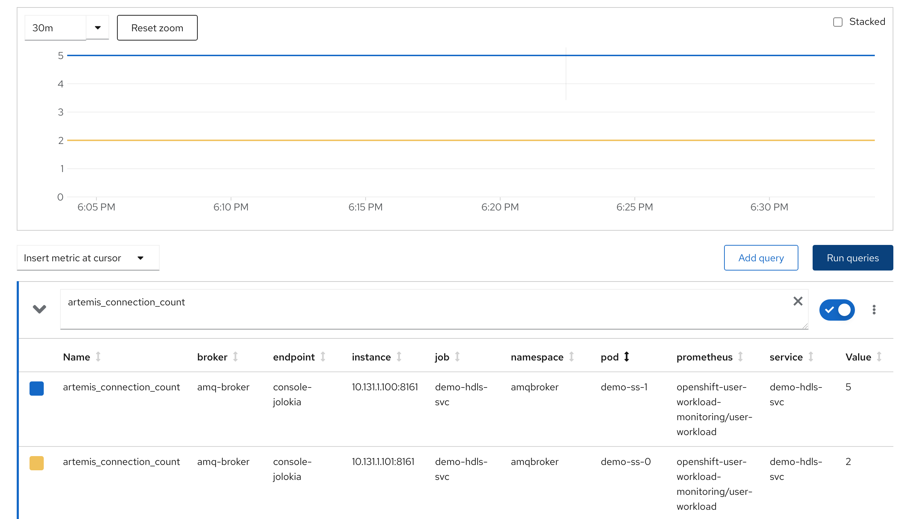
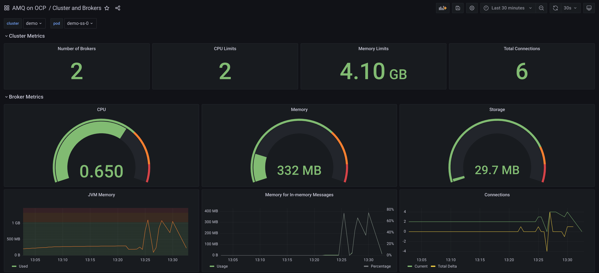
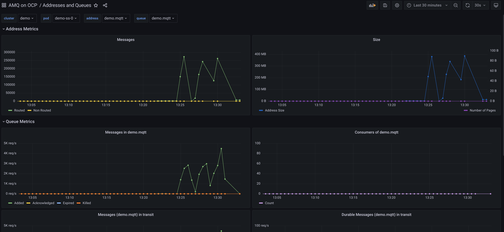

# Artemis monitoring in OpenShift

It is really simple to monitor the brokers deployed on OpenShift and show the metrics in grafana or configuring alerts based on the metrics. We are using the artemis version included in AMQ 7.9 deployed with the operator.

## Configuring user workload monitoring

We can use a custom prometheus operator deployed on OpenShift, or just enable the user workload monitoring following the simple steps on [this document](https://docs.openshift.com/container-platform/4.9/monitoring/enabling-monitoring-for-user-defined-projects.html)

## Exposing prometheus metrics

When a set of brokers are deployed, in the deploymentPlan section, the metrics plugin should be enabled. Be sure to use the correct ArtemisBroker Custom Resource version (`broker.amq.io/v2alpha5`) as previous ones did not include this field.

```yml
  deploymentPlan:
    enableMetricsPlugin: true
```

With that configuration, a prometheus endpoint will be exposed through the console-jolokia endpoint of every broker in the set. We have included [this example](code/demo-activemqartemis.yaml) of a cluster with the configuration enabled.

## Prometheus Scrape configuration

When prometheus is deployed in the cluster using the operator, the easiest way to set up the scrape is using a [ServiceMonitor](https://prometheus-operator.dev/docs/operator/design/#servicemonitor) Object, like the [following one](code/demo-servicemonitor.yaml).

```yml
apiVersion: monitoring.coreos.com/v1
kind: ServiceMonitor
metadata:
  name: amqbroker-service-monitor
  labels:
    app: demo-app
spec:
  selector:
    matchLabels:
      ActiveMQArtemis: demo
  endpoints:
  - path: /metrics
    port: console-jolokia
```

Where the label `ActiveMQArtemis` must match the cluster name.

Once the user workload prometheus server reloads the configuration and start scrapping the metrics, we can look at them in the console as any other workload.



## Metrics explained

### JVM

The JVM metrics are the usual ones exposed through micrometer for java applications. In this case

- `jvm_buffer_count_buffers`: An estimate of the number of buffers in the pool
- `jvm_buffer_memory_used_bytes`: An estimate of the memory that the Java virtual machine is using for this buffer pool
- `jvm_buffer_total_capacity_bytes`: An estimate of the total capacity of the buffers in this pool
- `jvm_memory_committed_bytes`: The amount of memory in bytes that is committed for the Java virtual machine to use
- `jvm_memory_max_bytes`: The maximum amount of memory in bytes that can be used for memory management
- `jvm_memory_used_bytes`: The amount of used memory

### Artemis metrics

Artemis metrics can be organized by broker, by address and by queue.

#### By broker

There are five metrics global for a broker, two related with memory, one for disk storage and two more for connections. 

- `artemis_address_memory_usage`: Memory used by all the addresses on broker for in-memory messages
- `artemis_address_memory_usage_percentage`: Memory used by all the addresses on broker as a percentage of the global-max-size
- `artemis_disk_store_usage`: Fraction of total disk store used
- `artemis_connection_count`: Number of clients connected to this server
- `artemis_total_connection_count`: Number of clients which have connected to this server since it was started

#### By address

There are four metrics per address in a broker, two related with messages and other two related with storage and pages

- `artemis_routed_message_count`: Number of messages routed to one or more bindings
- `artemis_unrouted_message_count`: Number of messages not routed to any bindings
- `artemis_number_of_pages`: number of pages used by this address
- `artemis_address_size`: the number of estimated bytes being used by all the queue(s) bound to this address; used to control paging and blocking

#### By queue

Related with consumers:

- `artemis_consumer_count`: number of consumers consuming messages from this queue

Related with reception and store status of messages:

- `artemis_messages_acknowledged`: number of messages acknowledged from this queue since it was created
- `artemis_messages_added`: number of messages added to this queue since it was created
- `artemis_messages_expired`: number of messages expired from this queue since it was created
- `artemis_messages_killed`: number of messages removed from this queue since it was created due to exceeding the max delivery attempts

Related with delivery status of messages in total and durable ones:

- `artemis_message_count`: number of messages currently in this queue (includes scheduled, paged, and in-delivery messages)
- `artemis_scheduled_message_count`: number of scheduled messages in this queue
- `artemis_delivering_message_count`: number of messages that this queue is currently delivering to its consumers

- `artemis_durable_message_count`: number of durable messages currently in this queue (includes scheduled, paged, and in-delivery messages)
- `artemis_scheduled_durable_message_count`: number of durable scheduled messages in this queue
- `artemis_delivering_durable_message_count`: number of durable messages that this queue is currently delivering to its consumers

Related with size and paging of messages in total and durable ones:

- `artemis_persistent_size`: persistent size of all messages (including durable and non-durable) currently in this queue (includes scheduled, paged, and - `artemis_scheduled_persistent_size`: persistent size of scheduled messages in this queue
- `artemis_delivering_persistent_size`: persistent size of messages that this queue is currently delivering to its consumers

- `artemis_durable_persistent_size`: persistent size of durable messages currently in this queue (includes scheduled, paged, and in-delivery messages in-delivery messages)
- `artemis_scheduled_durable_persistent_size`: persistent size of durable scheduled messages in this queue
- `artemis_delivering_durable_persistent_size`: persistent size of durable messages that this queue is currently delivering to its consumers

## Sample Grafana Dashboards

With all this information in mind, it is pretty easy to build nice dashboards that can show all the metrics, selecting a broker, address in that broker and queue in that address for drilling down on the different levels.

As Kubernetes is also exposing metrics per pod and persistentvolumeclaim, it is very useful to mix both to get a further insight on what is happening.

A sample [top level dashboard](code/clusters-brokers.json) can be shown in the following picture.



A [detailed one](code/addresses-queues.json) can be the following one:

