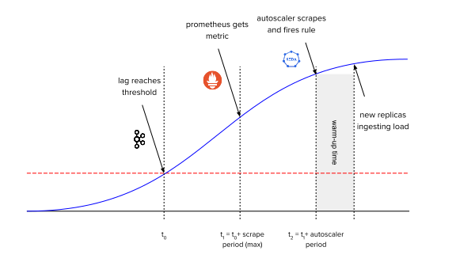
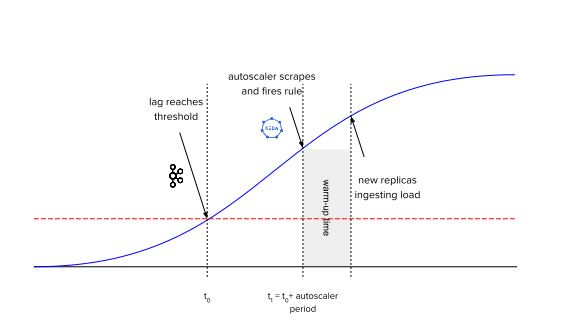
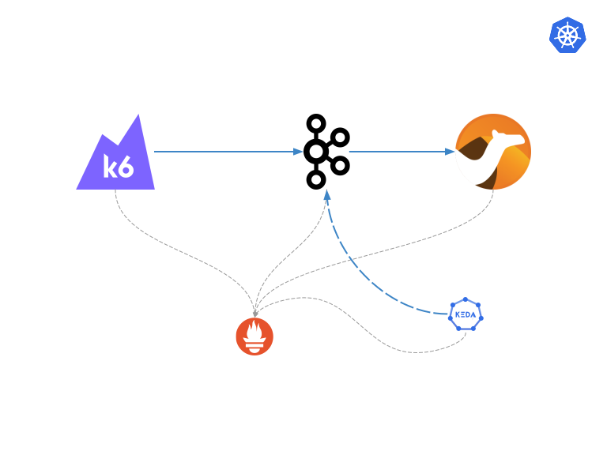
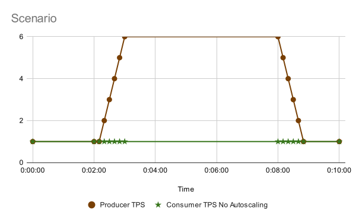
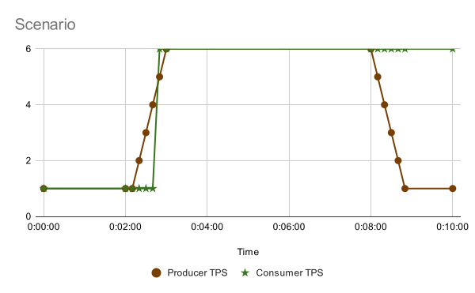
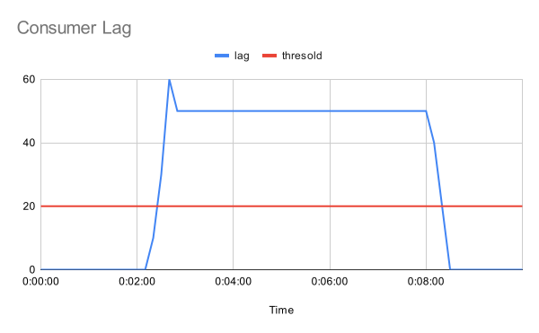
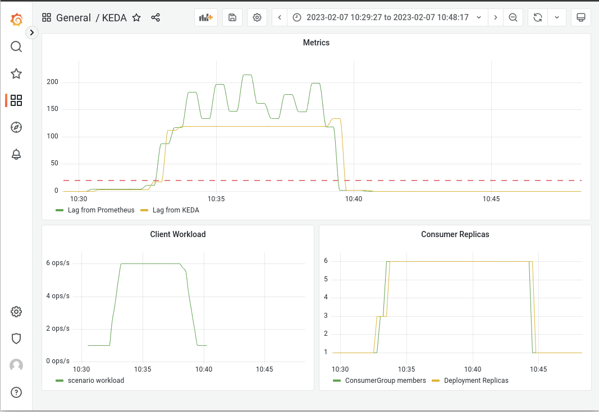

One of the most appealing features of container orchestrators like kubernetes is the ability to adapt the resources consumption to the need at that moment. At some point, the architects start to think about scaling the workloads in a smart way.

Kubernetes provides two native mechanisms for autoscaling the workloads, the [horizontal pod autoscaler](https://kubernetes.io/docs/tasks/run-application/horizontal-pod-autoscale/) (hpa) and the [vertical pod autoscaler](https://github.com/kubernetes/autoscaler/tree/master/vertical-pod-autoscaler) (vpa), however the latter in my opinion is not a transparent scaler.

Then, why introduce a new component for that purpose? Let's see in depth in the following article.

## The problem: Native autoscalers are not enough

Scalers are based on workload metrics. The native ones were designed to be generic, so the basic container metrics were defined, CPU and memory.

First of all, you need a compatible metrics stack to provide metrics to it. The de-facto stack for kubernetes metrics is prometheus. It can provide not only the usual metrics but also custom ones, and that metrics can be used also for HPA.

However, prometheus is not always the best alternative to extract relevant information from components in some use cases. In this case, a kafka broker exposes some metrics through its admin API, but depending on the distribution, it is not easy to expose that information in [OpenMetrics](https://openmetrics.io), that is used in prometheus.

Additionally, prometheus scrape metrics with some delay depending on the scrape period, as it is a pull mechanism. If a scaler also needs to pull metrics from prometheus, two delays are added from the time the metric reaches a certain threshold. This can be a problem in some scenarios, such as when you need to scale up/down quickly.

 vs 

## KEDA

[KEDA](https://keda.sh/) is a single-purpose and lightweight component that can be added into any Kubernetes cluster. It extends functionality without overwriting or duplication. The diagram below illustrates how it works in combination with other Kubernetes parts.

It is the perfect fit when the application or component needs to scale based on other criteria than usual CPU/memory metrics. One usual example that I will explore in this blog, is an async event-driven architecture where consumers should adapt to the lag (number of messages that are queued to be consumed).

Some question that could be raised here is if in this architecture it is valid just to stick to the CPU/memory consumption of consumers. The answer is "it depends". If the consumer is a CPU intensive workload, like doing some calculations, it could be used. However, if it is a job like sending the message to an s3 remote object storage, maybe the consumer is mostly waiting idle for a reply, with low CPU consumption, but messages growing in the brokers.

## Testing KEDA

### Main architecture

In some previous articles, I have shown the preference for using kubernetes as much as possible. This one would not be an exception, so I would try to deploy everything inside if possible.

Another criteria to select the toolings is to be open sourced, and have a decent community behind them. I would explain in every tool my particular reasons in this area. I have not explored all the alternatives, so it could be any other better, just send me a message if you find it.

The following picture shows all the components and relations between them. I will explain them in detail in the following sections.

To avoid having to install a full prometheus stack, I will use OpenShift, an compliant kubernetes distribution in steroids, that comes with it already deployed and easy to [configure for scrapping user defined namespaces](https://docs.openshift.com/container-platform/4.12/monitoring/enabling-monitoring-for-user-defined-projects.html).

### Kafka Brokers: strimzi

First and most important, kafka brokers are needed to route messages between producers and consumers. As I wanted it to be as easy as possible, and I want the component to provide not only the API for getting metrics but also prometheus metrics that I can correlate, I selected [strimzi](https://strimzi.io). I would link to a [previous article](https://blog.ramon-gordillo.dev/2021/10/benchmarking-apache-kafka-kubernetes-revisited-with-ceph/) on kafka performance loading to have some details and examples on how to deploy those brokers.

As a rough summary, I will use [strimzi operator](https://strimzi.io/docs/operators/latest/overview.html) and define some CRs to create the cluster. 

I need to include the kafka exporter in the strimzi cluster CR, so metrics in prometheus can be used to correlate what is happening and check if metrics provided by the exporter are coherent with the metrics provided by the scaler.

The files I am using come from the original repo, the [cluster example with metrics](https://github.com/strimzi/strimzi-kafka-operator/blob/main/examples/metrics/kafka-metrics.yaml) and the [PodMonitor](https://github.com/strimzi/strimzi-kafka-operator/blob/main/examples/metrics/prometheus-install/strimzi-pod-monitor.yaml) to enable prometheus scrapping on the targets. The topic (name: test) can be created with a CR like the [topic example](https://github.com/strimzi/strimzi-kafka-operator/blob/main/examples/topic/kafka-topic.yaml) just changing the name, or letting the brokers create it automatically.

Remember to set up the [number of partitions](https://kafka.apache.org/documentation/#intro_concepts_and_terms) for the topic at least as a maximum of replicas of consumers. Otherwise, when scaling up and reaching the number of partitions, the consumers will be blocked without consuming new messages.

### Load generator: k6 producer

First option I always try to use is the native performance client of the technology that I am experimenting with if that exists. In kafka brokers, there is a command line that I used for performance purposes, `kafka-producer-perf-test.sh`. However, as it is very limited in features, I decided to go for a generic load generator tool.

There are several tools available in the market, even open source projects that can be used as a performance load generator. JMeter, gatling, apache benchmark, taurus, locust, postman... Lots of them can be named here.

When I was thinking about which one to use, I read several comparisons to understand the ups and downs of them. However, in my list I decided to reduce based on the following criteria:

- MUST: be deployed and run natively in kubernetes. Generating load for a small period of time is not the usual kubernetes steady workload, and is more suitable for jobs than for deployments/statefulsets. Some kind of controller may be needed to start
- MUST: Need multi-protocol support. Most of the tools are meant for testing APIs or HTTP endpoints. That would reduce the list a lot.
- MUST: be able to model workload in a flexible way. My intention is not to create the usual static load or even ramp-up/cool-down (which is good for a start), but to be able in the future to model more complex workloads. 
- NICE TO HAVE: export producer metrics to prometheus. It is then easier to collect them directly from the producer than inferring from the brokers.
- NICE TO HAVE: provide an user interface to define the test cases and connectivity.

That led me to [k6](https://k6.io/). It is a relatively recent project, and I want to go through my checklist.

- K6 has an [operator](https://github.com/grafana/k6-operator) to be deployed, so I can define my load tests using kubernetes custom resources, which is a very handy and repeatable way.
- It has a pluggable architecture, and one [extension for apache kafka](https://github.com/mostafa/xk6-kafka).
- It implements [scenarios](https://k6.io/docs/using-k6/scenarios) which can model complex workload set up.
- k6 client and the kafka extension provides [a way to push metrics to a prometheus server](https://k6.io/docs/results-output/real-time/prometheus-remote-write). In my case, I will need a server that is able to accept remote write, as this is the way to send the metrics.
- It lacks (yet) a visual interface to define the load, but the documentation is extensive enough to not be a blocking issue.

So to be used, this steps should be followed:

1) First, create an image with the extensions needed. This is the [container file](code/k6/Dockerfile) I have used.
2) Define the test and the scenarios in a [ConfigMap](code/k6/kafka-producer-1-cm.yaml) to be injected by the k6 controller during the test.
3) Create the [k6 test](code/k6/k6-sample-kafka.yaml) when you want to launch the test.

### Deterministics consumers

Once I am ready to send the messages to the brokers, there should be a way to define exactly the ingestion rate and therefore to be able to calculate the lag (queue size).

First, I played with the kafka standard console consumer in a consume-and-sleep loop. However, as I was running the command in each iteration, I realized it was very difficult to correlate the number of replicas with the number of consumers (if some replicas were in the sleep part of the loop, they were not connected).

So I decided to go for a little more flexible solution, and that led me to [Camel K](https://camel.apache.org/camel-k). Camel K is a simple way of defining integration routes with EIP in a kubernetes-native approach (Operator + Custom Resources).

Installed with the operator comes several [kamelets](https://camel.apache.org/camel-k/1.11.x/kamelets/kamelets-user.html) ( parameterized components). I will use the [kafka-source](https://camel.apache.org/camel-kamelets/3.20.x/kafka-source.html) for extracting the message, the [throttle-action](https://camel.apache.org/camel-kamelets/3.20.x/throttle-action.html) to define exactly the ingestion rate and the [log-sink](https://camel.apache.org/camel-kamelets/3.20.x/log-sink.html), to send it to the stdout of the container (in case I need to check anything), but there are hundred of them.

This [link](code/camel-k/kafka-deterministic-consumer-kameletbinding.yaml) shows the KameletBinding used as a deterministic consumer.

Although I am setting everything by my own, there is [an annotation](https://camel.apache.org/camel-k/1.11.x/kamelets/kamelets-user.html#kamelet-keda-user) to define a KameletBinding to automatically set up a KEDA autoscaler. That option can be explored in the future to simplify the set up.

## Monitoring everything

During the component definition, one of the main goals is to have the ability to monitor everything, from the load generator, the broker and consumers, but also what the autoscaler is reporting, so I can match up the source data with the actions taken, and tune all the parameters the better I am able to.

### k6 workloads

As I have explained previously, I am sending k6 producer metrics to a remote prometheus. The relevant metrics that I will use are:

`k6_kafka_writer_message_count_total`: represents the number of messages sent. I do a `sum`, to aggregate all the scenarios and use the `irate` function to get the rate of them. 

OpenShift does not include the option in their prometheus to accept remote write operations from external sources. Though, I deploy another instance to receive the k6 metrics, and let the official prometheus endpoint to scrape them from it using [prometheus federation](https://prometheus.io/docs/prometheus/latest/federation).

### Brokers

Strimzi is exposing tons of metrics using prometheus. One that is key in this test is `kafka_consumer_lag`, which shows the number of messages that are waiting for a consumer group to be processed. That is a similar metric than the one KEDA will check to scale up/down the workloads. KEDA does some additional calculations for corner cases and may show a slightly different metric.

I am also interested in `kafka_consumergroup_members` to double check replicas with other metrics in consumers.

Remember those metrics land in prometheus at a certain point in time depending on the scrape period, which can be different in time than the one autoscaler gets. 

### Consumers

In my tests, I am not interested in the ingestion rate, as a deterministic consumer has been used and it is easy to calculate.

Instead, my interest is to know how many replicas (consumers) are working in each moment, and therefore are active from a scaling point of view. `kube_deployment_status_replica` for the deterministic consumer is the one that I need to know any time the number of active replicas.

### Autoscaler

From the autoscaler point of view, the metric I am interested in is `keda_metrics_adapter_scaler_metrics_value`. That would provide the metric that the scaler would use for taking a decision on scaling or not.

## Testing all together

I plan the thresholds for my tests, and model the producer/consumer workloads for the scale up/down to happen during the tests. For a simple one, I am planning a flat warm up, an increase in the producer to reach the scale up threshold and then a decrease to scale down again. This is the sample scenario that I have linked earlier.

The following picture is showing the model in the producer rate and a consumer rate if no autoscaling were in place.

I will assume some delay when scaling the consumers with KEDA, a similar approach like:

With that producer rate, and a steady consumer rate, the theoric consumer lag is shown in the following picture. I have also included the threshold that is configured in the sample test.

When everything is running, I just need to instantiate the defined [k6 test](code/k6/k6-sample-kafka.yaml) and monitor everything. 

Looking at a [grafana dashboard I built for the test](code/grafana/KEDA-1675689282291.json), I see the following reasoning

- There is always a delay between the moment that a metric reaches a certain threshold and the moment the autoscaler detects it.
- When the autoscaler detects it needs to scale up, a number of replicas are started but they are not ready yet. Depending on several factors (technology, number of components, etc), each replica can take some time and the metric could potentially be still growing.
- Bigger delay is usual between the time a metric goes below a threshold and the autoscaler detects it. That avoids replica flapping if workload fluctuates near the threshold. The default value for ScaledObjects is 300 secs (5 mins), which we can see in the graph.

## Final thoughts

To avoid glitches when metrics may have spikes, a warm up and cool down period should be used. There should be a compensation between avoiding spikes and being very late when scaling. The parameters that govern that behavior should be tuned and monitored, so there is no unbalance to any side.

The architecture shown here is simplified with respect to what is supposed to be in a real case. Usually, the consumer calls other services/databases in a chain/tree, which should also be scaled to absorb the workload. This is not always the case and scaling one single workload may cause more contention on the backends than waiting for the messages to be consumed at a defined (and predictable) rate.

When scaling pods, it may happen that there is no capacity in the kubernetes cluster to allocate all those nodes.  Another features like the [Cluster Autoscaler](https://github.com/kubernetes/autoscaler/tree/master/cluster-autoscaler) can be used, which spin ups new nodes if they are not enough to find room to the container workload.

It is very recommended to put limits on your scaling targets to avoid awkward situations where the consumption has grown more than expected. Ideally, the limits should be enforced at several levels, and quota management is a MUST in complex organizations.

Metrics-based autoscalers based on watermarks are reactive by design. That means that when a metric reaches a certain threshold, the workload is in an urgent situation. Next step is to build up further intelligence, so they could be proactive. That would mean introducing predictive algorithms (mostly AI-based) that are able to infer if the workload is very likely to reach limit levels before they get there, so the workload can scale up and be ready to handle the increase. Both KEDA and AI can be working together with KEDA external scalers that can be fed by AI trained models, like this [example](https://keda.sh/blog/2022-02-09-predictkube-scaler).

Complex Kubernetes Architectures includes workloads spread in several clusters and load balanced among them. The autoscaler is a single-cluster feature (at this moment), which means that if a common infrastructure (like kafka) is used and monitored from all the clusters, the autoscaler would scale up/down in all of them at the same time, which is not a desired situation in all the cases. It is possible to play with ramp up/cool down parameters, so they are slightly different on each cluster, and give some of them more priority when scaling. That would also decouple the behavior, but it would not have the multi-cluster visibility approach that could be another evolution for the future.