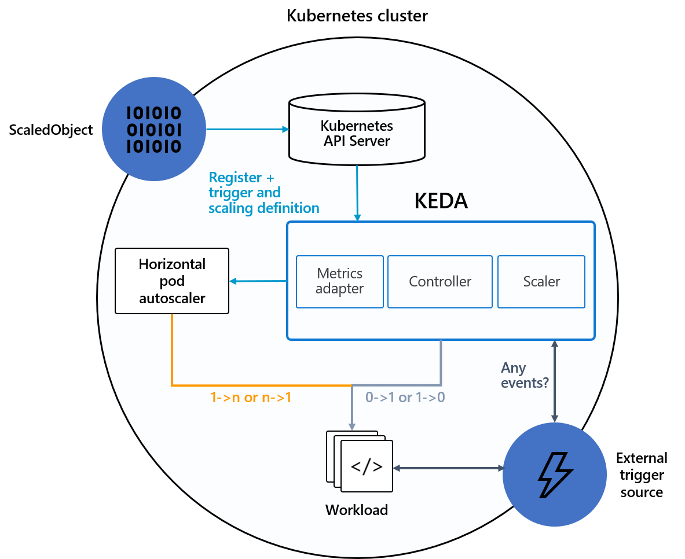

One of the most appeling features of container orchestrators like kubernetes is the ability to adapt the resources consumption to the need at that moment. At some point, the architects start to think about scaling the workloads in a smart way.

Kubernetes provides two native mechanisms for autoscaling the workloads, the [horizontal pod autoscaler](https://kubernetes.io/docs/tasks/run-application/horizontal-pod-autoscale/) (hpa) and the [vertical pod autoscaler](https://github.com/kubernetes/autoscaler/tree/master/vertical-pod-autoscaler) (vpa), however the latter in my opinion is not a transparent scaler.

Then, why introducing a new component for that purpose? Let's see in depth in the following article.

## The problem: Native autoscalers are not enough

Scalers are based on workload metrics. The native ones were concepted to be generic, so the basic container metrics were defined, CPU and memory.

So, first of all, you need a compatible metrics stack to provide metrics to it. The de-facto stack for kubernetes metrics is prometheus. It can provide not only the usual metrics but also custom ones, and that metrics can be used also for HPA.

However, prometheus is not always the best alternative to extract relevant information from components in some use cases. In our case, a kafka broker expose some metrics through its admin API, but depending on the distribution, it is not easy to expose that information in [OpenMetrics](https://openmetrics), that is used in prometheus.

## KEDA

[KEDA](https://keda.sh/) is a single-purpose and lightweight component that can be added into any Kubernetes cluster. It extends functionality without overwriting or duplication. The following picture shows how interacts with other kubernetes components.

It is the perfect fit when the application or component needs to scale based on other criteria than usual CPU/memory metrics. One usual example that we will explore in this blog, is an async event-driven architecture where consumers should adapt to the lag (number of messages that are queued to be consumed).

Some question that could be raised here is if in this architecture we can just stick to the CPU/memory consumption of consumers. The answer is "it depends". If the consumer is a CPU intensitive workload, like doing some calculations, you can do it. However, if it is job like sending the message to an s3 remote object storage, maybe the consumer is mostly waiting idle for a reply, with low CPU consumption, but messages growing in the brokers.

## Testing KEDA

### Main architecture

In some previous articles, I have shown the preference for using kubernetes as much as possible. This one would not be an exception, so I would try to deploy everything inside if possible.

Another criteria to select the toolings is to be open sourced, and have a decent community behind them. I would explain in every tool my particular reasons in this area. I have not explored all the alternatives, so it could be any other better, just send me an message if so.

The following picture shows all the components and relations between them. We will explain them in detail in following sections.

To avoid having to install a full prometheus stack, I will use OpenShift, an compliant kubernetes distribution, that comes with it already deployed and easy to [configure for scrapping user defined namespaces](https://docs.openshift.com/container-platform/4.12/monitoring/enabling-monitoring-for-user-defined-projects.html).

### Kafka Brokers: strimzi

First and most important, we need kafka brokers to send messages between producers and consumers. As we wanted to be as easy as possible, and we want to provide not only the API for getting metrics but also prometheus metrics that we can correlate. I would link to a [previous article](https://blog.ramon-gordillo.dev/2021/10/benchmarking-apache-kafka-kubernetes-revisited-with-ceph/) on kafka performance loading to have some details and examples on how to deploy those brokers.

As a rough summary, we will use [strimzi operator](https://strimzi.io) and define some CRs to create the cluster. 

We need to include the kafka exporter in the strimzi cluster CR, so we can get the metrics in prometheus to correlate what is happening and check if metrics provided by the exporter is coherent with the metrics provided by the scaler.

The files we are use come from the original repo, the [cluster example with metrics](https://github.com/strimzi/strimzi-kafka-operator/blob/main/examples/metrics/kafka-metrics.yaml) and the [PodMonitor](https://github.com/strimzi/strimzi-kafka-operator/blob/main/examples/metrics/prometheus-install/strimzi-pod-monitor.yaml) to enable prometheus scrapping on the targets. The topic (name: test) can be created with a CR like the [topic example](https://github.com/strimzi/strimzi-kafka-operator/blob/main/examples/topic/kafka-topic.yaml) just changing the name, or letting the brokers create it automatically.

### Load generator: k6 producer

First option I always try to use is the native performance client of the technology that I am using if one exists. In kafka brokers, there is a command line that I used for performance purposes, kafka-producer-perf-test.sh. However, as it is very limited in features, I decided to go for a generic load generator tool.

There are several tools available in the market, even open source projects that can be use as a performance load generator. JMeter, gatling, apache benchmark, taurus, locust, postman... Lots of them can be named here.

When I was thinking about which one to use, I read several comparisons to understand the up and downs of them. However, in my list I decided to reduce based on the following criteria:

- MUST: be deployed and run natively in kubernetes. Generating load for an small period of time is not the usual kubernetes steady workload, and is more suitable for jobs than for deployments/statefulsets. Some kind of controller may be needed to start
- MUST: Need multi-protocol support. Most of the tools are meant for testing APIs or HTTP endpoints. That would reduce the list a lot.
- MUST: be able to model workload in a flexible way. My intention is not to create the usual static load or even ramp-up/cool-down (which is good for a start), but to be able in the future to model more complex workloads. 
- NICE TO HAVE: export producer metrics to prometheus. It is then easier to collect them directly from the producer than infering from the brokers.
- NICE TO HAVE: provide an user interface to define the connectivity

That lead me to [k6](https://k6.io/). It is a project relative recent, and I want to go through my checklist.

- K6 has an [operator](https://github.com/grafana/k6-operator) to be deployed, so I can define my load tests using kubernetes custom resources, which is a very handy and repeatable way.
- It has a pluggable architecture, and one [extension for apache kafka](https://github.com/mostafa/xk6-kafka).
- It implements [scenarios](https://k6.io/docs/using-k6/scenarios) which can model complex workload set up.
- k6 client and the kafka extension provides [a way to push metrics to a prometheus server](https://k6.io/docs/results-output/real-time/prometheus-remote-write). In our case, we will need a server that is able to accept remote write, as this is the way to send the metrics.
- It lacks (yet) a visual interface to define the load, but the documentation is extensive enough to not be a blocking issue.

So to be used, we need the following steps:

1) First, create an image with the extensions needed. This is the [container file](code/k6/Dockerfile) I have used.
2) Define the test and the scenarios in a [ConfigMap](code/k6/kafka-keda-1-cm.yaml) to be inyected by the k6 controller during the test.
3) Create the [k6 test](code/k6/k6-sample-kafka.yaml) when you want to lauch the test.

### Deterministics consumers

Once we are ready to send the messages to the brokers, we need a way to define exactly the ingestion rate and therefore to be able to calculate the lag (queue size).

First, I played with the kafka standard console consumer in a consume-and-sleep loop. However, as I was running the command in each iteration, I realize it was very difficult to correlate the number of replicas with the number of consumers (if some replicas were in the sleep part of the loop, they were not connected).

So I decided to go for a little more flexible solution, and that lead me to [Camel K](https://camel.apache.org/camel-k). Camel K is a simple way of defining integration routes with EIP in a kubernetes-native approach (Operator + Custom Resources).

## Monitoring everything

During the component definition, one of the main goals is to have the ability to monitor everything, from the load generator, the broker and consumers, but also what the autoscaler is reporting, so we can match up the source data with the actions taken, and tune all the parameters the better we are able to.

### k6 workloads

As we have explained previously, we are sending k6 producer metrics to a remote prometheus. The relevant metrics that we will use are:

`k6_kafka_writer_message_count_total`: represents the number of message sent. We should do a `sum`, to aggregate all the scenarios and use `ìrate` function to get the rate of them. 

OpenShift does not include the option in their prometheus to accept remote write operations from external sources. Though, we will deploy a sample one to gather the k6 metrics, and let the official prometheus endpoint to scrape them from it using [prometheus federation](https://prometheus.io/docs/prometheus/latest/federation).

### Brokers

### Consumers

### Autoscaler

## Custom Autoscaling with KEDA

## Final thoughts

To avoid glitches when metrics may have spikes, a warm up and cool down period should be used. There should be a compensation between avoiding spikes and being very late when scaling. The parameters that governs that behaviour should be tuned and monitored, so there is no unbalance to any side.

The architecture shown here is simplified respect what is supposed to be in a real case. Usually, the consumer calls other services/databases, which should also be scaled to absorv the workload. This is not always the case and scaling one single workload may cause more contention on the backends that waiting for the messages to be consumed at a defined (and predictible) rate.

When scaling pods, it may happen that there is no capacity in the kubernetes cluster to allocate all those nodes. We can use another features like the [Cluster Autoscaler](https://github.com/kubernetes/autoscaler/tree/master/cluster-autoscaler), which spin ups new nodes if they are node 
Node autoscalers

Metrics-based autoscalers based on watermarks are reactive by design. That means that when a metrics reaches certain thresold, the workload is now in a limit situation. Next step is to build up further intelligence, so they could be proactive. That would mean to introduce predictive algorithms (mostly AI-based) that are able to infer if the workload is very probably to reach limit levels before they get there, so the workload can scale up and be ready to handle the increase.

Complex Kubernetes Architectures includes workloads spread in several clusters and load balanced among them. The cluster autoscaler is a single-cluster feature (at this very moment), which means that if we use a common infrastructure (like kafka) and monitor it from all the clusters, the autoscaler would scale up/down in all of them at the same time, which is not a desired situation in all the cases. It is possible to play with ramp up/cool down parameters, so they are slightly different on each cluster, and give some of them more priority when scaling. That would also decouple the behaviour, but it would not have the multicluster approach that could be another enhancement for the future.