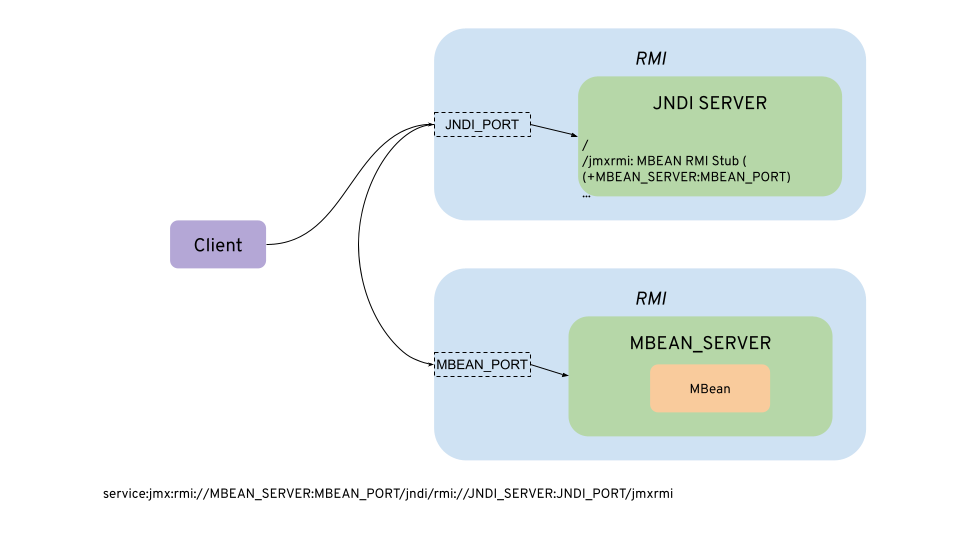
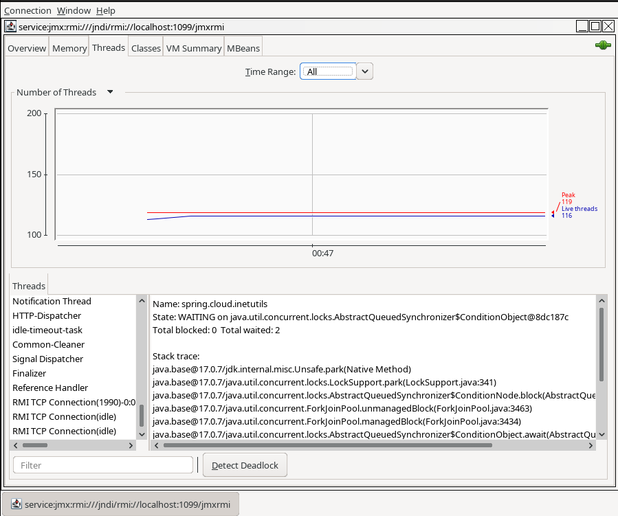
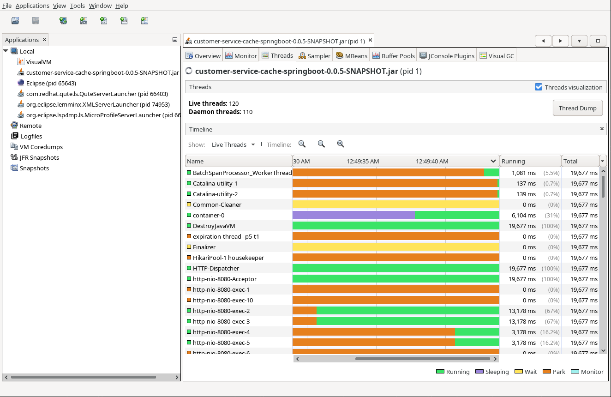
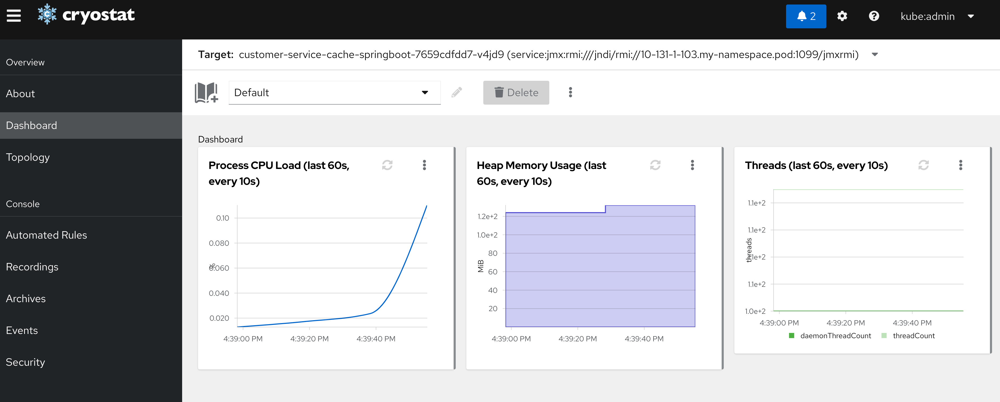
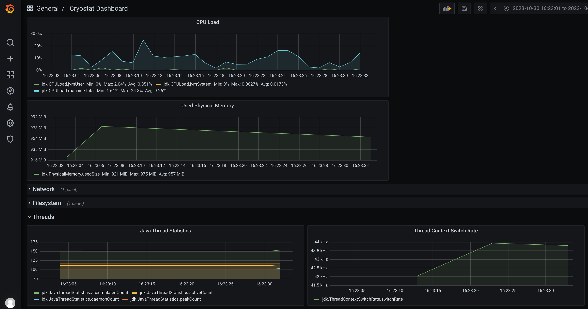

Recently, I had a situation where I needed to introspect on the memory of a java program running on kubernetes. The usual procedure is connecting to the container, getting a dump, collecting this dump from a standalone laptop/host and analyzing it offline.

However, I wanted to explore some other alternatives, so I would get here some additional techniques that can be used either from developers or for operations doing debugging or forensics.

# Java Management Extensions (JMX)

[Java Management Extensions](https://www.oracle.com/java/technologies/javase/javamanagement.html) is a standard developed for Java to monitor and manage applications. It exposes an API so the Java application can expose methods and attributes for introspecting and doing management operations.

On top of that, there have been several tools to use that API in a user friendly way. Some of them included (but not only) [jconsole](https://docs.oracle.com/en/java/javase/17/management/using-jconsole.html#GUID-77416B38-7F15-4E35-B3D1-34BFD88350B5), [visualvm](https://visualvm.github.io/) and particularly for kubernetes and flight recorder, [cryostat](https://cryostat.io/).

I would try to explain how connecting to a JMX API works, so we can better understand our options on those tools.

# How JMX connections are created

First, I need to explain that JMX is a very old technology. It was conceived even before the application server era, and that means a lot. So, it is not exposed in a HTTP standard way, but on top of Remote Method Invocation ([RMI](https://docs.oracle.com/en/java/javase/17/rmi/index.html#GUID-70825E99-57CF-470F-871A-5CCB6C2771BE)).

An RMI server had to be located with another java technology, Java Naming Directory Interface ([JNDI](https://docs.oracle.com/javase/tutorial/jndi/overview/index.html)). I would try to explain with a simple picture.



Let's see how it works.

Note: Please, if you look at the following referenced links, please look at your particular version, as they may have changed.

First, a server is used to expose the JNDI RMI server. That is what is configured usually with java properties as set in [this oracle doc](https://docs.oracle.com/en/java/javase/17/management/monitoring-and-management-using-jmx-technology.html#GUID-2C1922AD-4BA0-4397-A3FE-7823F42A94A3):

```properties
com.sun.management.jmxremote=true
com.sun.management.jmxremote.port=JNDI_PORT
```

Also, add ssl and/or credentials, or remove authentication at all using:

```properties
com.sun.management.jmxremote.ssl=false
com.sun.management.jmxremote.registry.ssl=false
com.sun.management.jmxremote.authenticate=false
```

If nothing else is configured, the server will publish its hostname and a random port to connect. This is the most common source of connection issues, indeed in kubernetes is very sensitive. There is another alternative, using another jmx property and also a rmi one from [this other doc](https://docs.oracle.com/en/java/javase/17/docs/specs/rmi/properties.html)

```properties
com.sun.management.jmxremote.rmi.port=MBEAN_PORT
java.rmi.server.hostname=MBEAN_SERVER
```

See [this point](https://docs.oracle.com/en/java/javase/17/management/monitoring-and-management-using-jmx-technology.html#GUID-34811D07-AB51-4EC7-8D37-EEAF7C15F5C7) for older versions that do not provide the former rmi property.

The `java.rmi.server.hostname` property is not relevant to the binding but for the reference of the remote stub. It would provide an alternative hostname for the RMI MBean to be located at. However, the `com.sun.management.jmxremote.rmi.port` is what the MBean RMI server is using and it is not possible to send a different RMI port than that.

In the client, as it does not know the MBEAN_SERVER and needs to lookup through JNDI, we should use the following url (as of [RFC 2609](https://www.rfc-editor.org/rfc/rfc2609.html)):

service:jmx:rmi:///jndi/rmi://<*JNDI_SERVER*>:<*JNDI_PORT*>/jmxrmi

With this url, the client connects to the JNDI Server and gets an RMI stub to connect to the MBean Server.

In some documents it is referenced an extended URL to bypass the RMI host/port resolution:

service:jmx:rmi://<*MBEAN_SERVER*>:<*MBEAN_PORT*>/jndi/rmi://<*JNDI_SERVER*>:<*JNDI_PORT*>/jmxrmi

But for using it, the client should implement some custom classes and inject them to the JMXConnectorServerFactory. It seems neither jconsole or visualvm do that, so they just use the ones provided by the RMI Stub.

# Kubernetes

In kubernetes, there is an overlay network which is not visible outside of the cluster. We have several alternatives to connect a tool to introspect java through remote jmx:

- Connect a client from outside using port-forwarding (`kubectl port-forward`). This is the option you will see in most examples, but it is not always possible due to access control restrictions.
- Connect a client from outside using an ingress/load balancer or nodeport.
- Deploy the tool inside kubernetes. It will have the DNS resolution of the cluster.

I will explore all those alternatives in the following sections

## Port Forwarding

It is the easiest approach. We cannot let the MBEAN_SERVER use a random port, as we need to forward both of them. Let's assume we use 1099 port for JNDI_PORT and 1098 for MBEAN_SERVER:

```bash
kubectl port-forward <pod> -n <namespace> 1099:1099 1098:1098
```

We will need to run the java process with, for example:

```properties
-Dcom.sun.management.jmxremote=true 
-Dcom.sun.management.jmxremote.port=1099
-Dcom.sun.management.jmxremote.authenticate=false
-Dcom.sun.management.jmxremote.rmi.port=1098
-Dcom.sun.management.jmxremote.ssl=false
-Dcom.sun.management.jmxremote.registry.ssl=false		
-Djava.rmi.server.hostname=localhost		
```

And run jconsole:

```bash
jconsole service:jmx:rmi:///jndi/rmi://localhost:1099/jmxrmi
```

It will connect through an insecure channel (no SSL).



With visualvm is pretty similar.

```bash
visualvm --openjmx service:jmx:rmi:///jndi/rmi://localhost:1099/jmxrmi
```



## Port Forwarding (secured mode)

I need to secure the RMI servers with SSL. I can do it in a traditional way, but in my case I have chosen the cert-manager operator to create the corresponding secrets for doing that.

```properties
com.sun.management.jmxremote.ssl=true
com.sun.management.jmxremote.registry.ssl=true
javax.net.ssl.keyStore=keystore
javax.net.ssl.keyStorePassword=password
```

And for the clients (jconsole/visualvm), copy the previous keystore as "truststore":

```properties
javax.net.ssl.trustStore=truststore
javax.net.ssl.trustStorePassword=password
```

If you have any issues when connecting jconsole or visualvm using SSL you can use [the following article](https://access.redhat.com/solutions/962343) to know how to set up debugging.

If you need to debug, I leave you my [logging.properties](code/logging/logging.properties). Use `jconsole -debug -J-Djava.util.logging.config.file=logging.properties` to do it. However, I have not been able that jconsole honored the `-Djavax.net.debug=all` to troubleshoot the ssl checks and handshakes, so I recommend to use visualvm which does with `visualvm -J-Djava.util.logging.config.file=logging.properties -J-Djavax.net.debug=all`.

With jconsole, I have not been able to use the "service" url and go though SslRMIClientSocketFactory for the rmi server, so I decided just to use the short host:port address, that seems to check for the required factory.

```bash
jconsole -J-Djavax.net.ssl.keyStore=truststore -J-Djavax.net.ssl.keyStorePassword=password localhost:1099
```

But visualvm is able to try with both factories with the openjmx url:

```bash
visualvm -J-Djavax.net.ssl.trustStore=certs/truststore.jks -J-Djavax.net.ssl.trustStorePassword=changeme --openjmx service:jmx:rmi:///jndi/rmi://localhost:1099/jmxrmi
```

## Ingress, Load Balancer or NodePorts

In my case, I use the haproxy ingress controller on an OpenShift cluster. The ingress cannot route a binary protocol unless it is secured with TLS using Service Name Indication (SNI), and all the secured services are exposed using port 443 and differentiated by the hostname part.

We have an SSL configuration in place. However, as we mentioned in the the JMXRemoteUrl description, both jconsole and visualvm overwrites the JMX RMI host:port with the remote RMI Stub, so unless the application in the container can run privileged and use the 443 port for the JMX RMI port, there is no way to make it work through the ingress.

Additionally, the implementation of RMI calls through firewalls via http proxies has been removed as of JDK 9.

If NodePort services is an option, it can be configured to forward to the destination. For doing that, it is needed that the NodePort effective service ports and the JNDI + MBean are exposing the same number, so just redirecting `java.rmi.server.hostname` to the NodePort mbean service will do the trick.  

## Cryostat

There are some situations where we cannot do port-forwarding and NodePort services are not allowed. For example, if we don't have permissions to do port-forwarding to pods (pods/portforward) or if there are no permissions at all at the pods.

Cryostat is a very handy tool that provides Java Flight Recorder inside kubernetes. It can be deployed with an operator, and automates the extraction of information in a very useful way.

For using it, follow the previous steps either in plain or secured way, but remove the `-Djava.rmi.server.hostname=localhost` from the server, as cryostat is running inside the cluster and can resolve the internal pod ips. Also, check the documentation to add the certificates needed if you want to use it in a SSL secured connection.



It also provides, if selected, a grafana instance where we can explore the recorded sessions.


