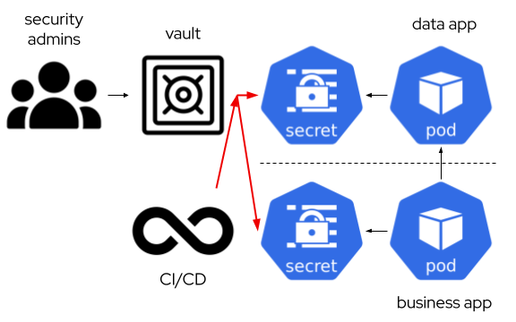
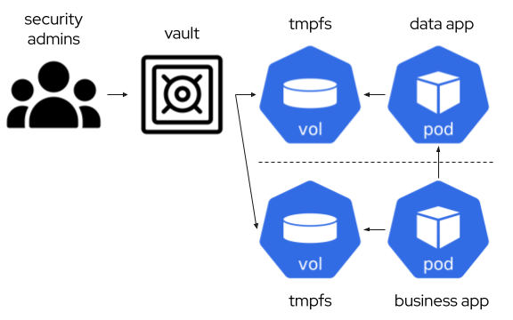
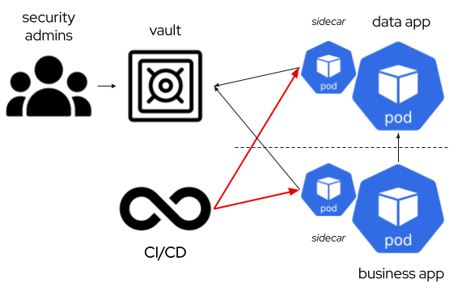
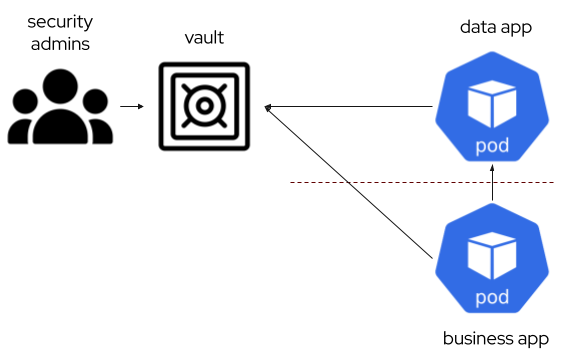
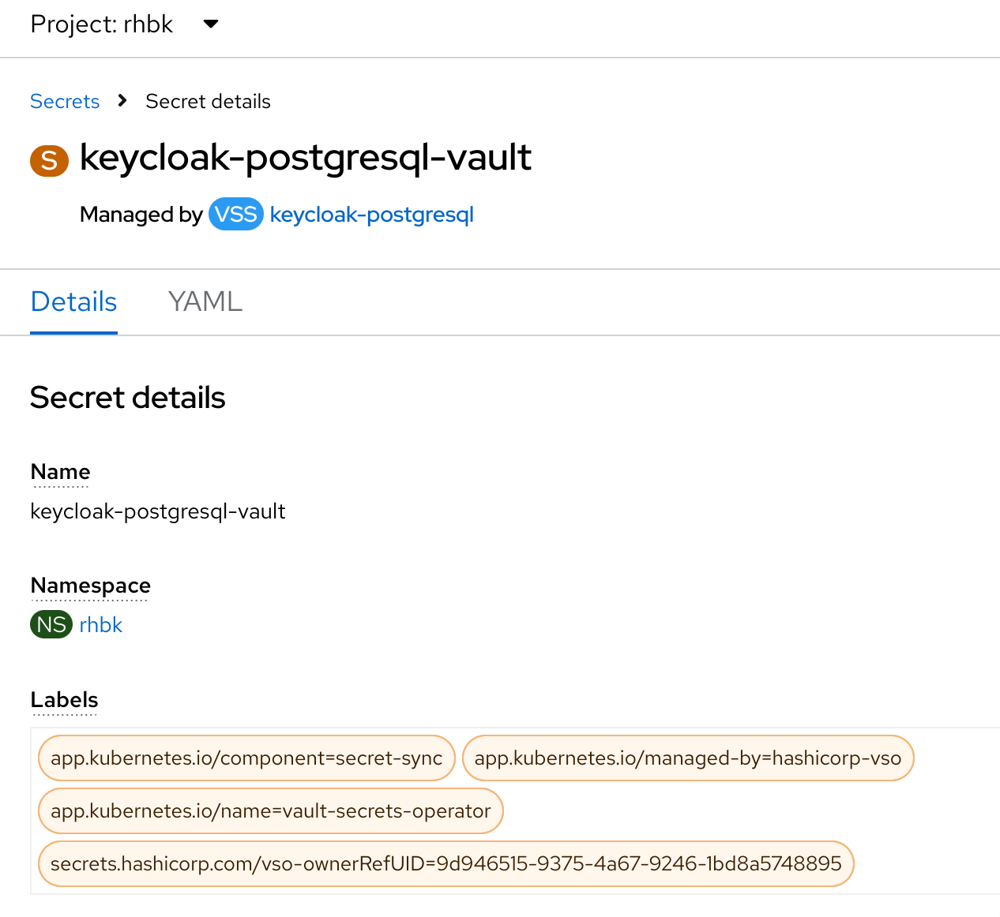
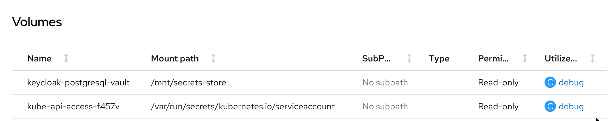
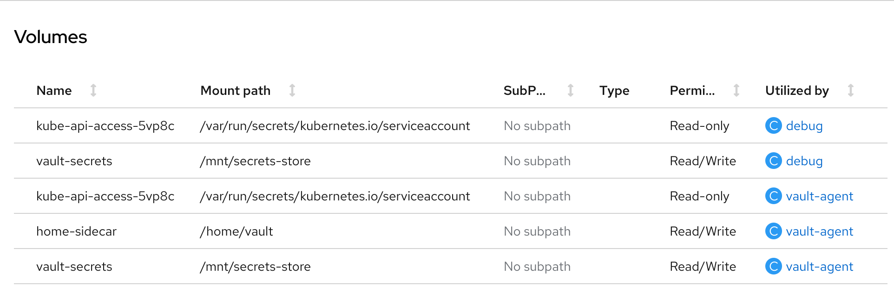

After several years working in the container space, I still hear in a lot of sessions and meetings that Kubernetes is not meant for running stateful applications. Of course, stateless apps are a lot more easier, less challenging and disposable than stateful apps. But in the end, almost every useful application depends on data. Kubernetes is a great choice to scale up/down apps and adapt them to demand, but if a database/broker/other-stateful-app cannot scale similarly, we can guess where the bottleneck and the limits would be.

The CNCF have created some working groups (WG) to show clearly the challenges with a clear vision to find alternatives to get the great capabilities of kubernetes for this kind of workloads. [This document](https://github.com/cncf/tag-storage/blob/master/data-on-kubernetes-whitepaper/data-on-kubernetes-whitepaper-databases.md) is a first version at moment of writing this article about most of them.

I don't like the term "demystifying". In this series of posts, I would try to enumerate some of those challenges and show with some examples that the statement about stateful apps is no more a limitation rather than some work to glue all pieces together.

# Credentials

In most products with a long-term lifecycle it is usual that a different set of credentials would be needed. Normally they are split on administrative, and the user. Administrative refers to credentials needed for high privileged operations (create resources, cluster coordination, backup/restore, etc). User credentials are those that applications use to connect to the resource and do the operations needed for the business logic (create/read/update/delete operations on their own schemas, for example), and following the least privilege principle, they should be reduced.

All these credentials are used to live in kubernetes secrets. However, kubernetes secrets are by default not very secret (indeed, they are only base64 encoded/decoded). Etcd can be encrypted at rest. In vanilla kubernetes, [this doc](https://kubernetes.io/docs/tasks/administer-cluster/encrypt-data/) can help with the set up. In OpenShift we may do the same with [the procedure described](https://docs.openshift.com/container-platform/4.15/security/encrypting-etcd.html)... or may use an external vault to manage those credentials. 

Managing credentials with a Vault provides extra capabilities for implementing security policies, rotation and expiration among others.

## Type of credentials

Admin credentials are usually needed at deployment time. Authentication for clustering, connecting observability, etc, are usual tasks that are part of the initial deployment. That means that:

1) There should be a mechanism to provide them before deployment
2) The deployment process should use those credentials instead of creating random ones.

User credentials are usually deployed with the application that needs them. 

In traditional architectures, these set of credentials were usually created and managed by one or different teams, and requested/updated using ticketing. In cloud native approach, a more automated approach is recommended.

## Providing credentials at deployment time

Credential vaults are gaining traction to store security data. For its use in kubernetes, there should be an automated way to be used by the data and the business application that uses it. 

During my work, I have seen several alternatives:

* Syncing the vault with plain kubernetes secrets. It is very simple, but as a drawback, the credentials are again visible to anyone with access to the secret. Still we have the master of the information in the vault and those extra expiration/rotation features available.



* Using Container Storage Interface (CSI) with a special storage driver, [Kubernetes Secrets Store CSI Driver](https://secrets-store-csi-driver.sigs.k8s.io/), that interacts with the vault software. That means the software is using the secret mounted as a file in a tmpfs partition in the container, and it does not use ENV vars with the credentials. If so, we can still use it, but then it would need to create a kubernetes secret syncing the secret data, so we are in the same situation as the previous point.



* Using a Mutating Webhook to inject a sidecar container that manages the access to the vault and sync credentials with files in the main pod. That provides a similar approach than the CSI driver, but with an easier setup and less changes in pod configuration.



* Interacting directly with the vault for the application. If the stateful application has some kind of extra scripting configuration before start, adding this possibility is very flexible and eliminates complex setup at kubernetes level. Upgrading the technology has to be validated against the procedure, but it can be automated similarly as usual developed applications in Continuous Integration pipelines.



## Showing an example of each procedure

For a simple setup, I am using an OpenShift cluster (4.15 at moment of writing) that I have at one of my labs. It would help me with a UI for navigating the objects, and monitoring everything is working as expected.

For Credential Management, I have selected for my example Hashicorp Vault. To install it, we can follow the [quick start](https://developer.hashicorp.com/vault/tutorials/kubernetes/kubernetes-openshift). Or just use the [script](code/vault/setup.sh) that I just linked.

I am using a postgresql database for the example. As I want this database to provide some extra capabilities, I am using one project that provides operator-based management in kubernetes, [stackgres](https://stackgres.io/). I can use it from the operator hub or just deploy it using its helm chart. I will set up a database called `keycloak-postgresql` for my future application.

### Vault - Secret Synchronization

First, we need to install the Vault Secrets Operator. It can be installed from the console, or just create [the subscription](code/kubernetes/vault/vault-secret-subscription.yaml) manually.

Then, a VaultConnection is needed. For simplicity, I would create [just one](code/kubernetes/vault/vaultconnection-vaultconnection.yaml) in the same namespace as the operator, but in a real production environment, one per tenant should be created. The vault connection refers to where the vault API endpoint is located, in this case it is internal to the cluster.

Now that we have the operator installed, we can configure the Vault with the secret, the policy and the role. The role and the policy will allow the secret operator to access the vault to sync with the kubernetes secret. I have used the following [script](code/vault/kv_secret.sh) to do it.

Finally, we have to create the objects to tell the operator to link the kubernetes secret with the vault. For this, first we create a VaultAuth on the target namespace that references the VaultConnection, with this [file](code/kubernetes/vault/staticauth-vaultauth.yaml). Once we have the static auth, we just create the VaultStaticSecret [object](code/kubernetes/vault/keycloak-postgresql-vss.yaml) that links all together. After some seconds, the secret would be available to be used when deploying the database.



Now it is time to deploy the database. As previously, we create the [stackgresql subscription](code/kubernetes/stackgres/stackgres-subscription.yaml).

Then, create the cluster. We have tons of options to customize, but I would create a [simple one](code/kubernetes/stackgres/keycloak-postgresql-sgcluster.yaml) and stick to a secret reference to the one synced from the vault.

### Kubernetes Secrets Store CSI Driver

[Kubernetes Secrets Store CSI Driver](https://secrets-store-csi-driver.sigs.k8s.io/) represent a way to mount [a temporary filesystem in memory](https://kubernetes.io/docs/concepts/storage/volumes/#emptydir). This is the option to just inyect credentials on memory to be used by the database.

The architecture is shown [here](https://secrets-store-csi-driver.sigs.k8s.io/concepts#how-it-works).

First, we need to deploy the CSI driver. In OpenShift, first we need to deploy the [Secrets Store CSI Driver Operator](code/kubernetes/csi/secrets-store-csi-driver-operator-subscription.yaml) and then the [Cluster CSI Driver](code/kubernetes/csi/secrets-store-clustercsidriver.yaml).

Then, we deploy the vault provider. We will update the original helm chart, configured now to deploy the daemonset with [this script](code/vault/update-setup-csi.sh).

Now it is time to test it. First, we need to create a SecretProviderClass that tells CSI which secret has to be mounted when a pod requests it. This [example](code/kubernetes/vault/keycloak-postgresql-spc.yaml) would be used, you can check the parameters for vault in [this doc](https://developer.hashicorp.com/vault/docs/platform/k8s/csi/configurations#secret-provider-class-parameters). Now it is time to create a pod and use the CSI mount. As most of the resources created by an operator cannot be changed easily, I am using a [sample deployment](code/kubernetes/debug/debug-deployment-csi.yaml) to show the mount.



Doing a sample `kubectl exec $POD -- cat /mnt/secrets-store/keycloak-postgresql-vault` we can get the full content in json (if configured, each value can be also mounted as a separate file):

```json
{
  "request_id": "07529382-6bb1-2a5b-bf4e-afded4356424",
  "lease_id": "",
  "lease_duration": 0,
  "renewable": false,
  "data": {
    "data": {
      "authenticator-password": "c6a6-caf7-4a28-b1d",
      "authenticator-username": "authenticator",
      "replication-password": "8758-18d3-43ca-a41",
      "replication-username": "replicator",
      "restapi-password": "5f86-9c99-4901-a10",
      "superuser-password": "51ce-e1b2-4e68-a7f",
      "superuser-username": "postgres"
    },
    "metadata": {
      "created_time": "2024-05-13T16:31:00.538035922Z",
      "custom_metadata": null,
      "deletion_time": "",
      "destroyed": false,
      "version": 1
    }
  },
  "warnings": null
}
```

### Sidecar Container

The sidecar injection use to be a metadata annotation that instructs a mutating webhook (in case of hashicorp vault, the agent injector) to add a sidecar container that connects to the vault and download the secret in a shared space between the sidecar and the application container.

It is the same approach as other technologies like istio add a companion container to abstract the application of the underlying technology to get the secret.

The list of annotations relevant for the injector are detailed [here](https://developer.hashicorp.com/vault/docs/platform/k8s/injector/annotations).

I used a similar approach as with CSI to test the feature, creating a [sample deployment](code/kubernetes/debug/debug-deployment-annotation.yaml).

The result pod contains an init-container which synchronizes the secret before starting two more containers, our application and a sidecar (`vault-agent`) to continue synchronizing if something changes.



Similar to what we do with CSI, we can check the values with `kubectl exec $POD -- cat /mnt/secrets-store/keycloak-postgresql-vault`:

```json
{
  "data": {
    "authenticator-password": "c6a6-caf7-4a28-b1d",
    "authenticator-username": "authenticator",
    "replication-password": "8758-18d3-43ca-a41",
    "replication-username": "replicator",
    "restapi-password": "5f86-9c99-4901-a10",
    "superuser-password": "51ce-e1b2-4e68-a7f",
    "superuser-username": "postgres"
  },
  "metadata": {
    "created_time": "2024-05-13T16:31:00.538035922Z",
    "custom_metadata": null,
    "deletion_time": "",
    "destroyed": false,
    "version": 1
  }
}
```

### Direct Access

Direct access from the container, while it is the most straightforward, it is complex to implement in an efficient way. Some stateful containers provide a method for running an script before and/or after running the technology, but it does not provide some continuous script to check if the credentials have been rotated to update them.

An example of that approach can be shown in [this deployment](code/kubernetes/debug/debug-deployment-direct.yaml). We are using a derived ubi9 image that also contains `jq` to parse the `VAULT_TOKEN` after the authentication.

Similar as the previous approach, doing a `kubectl exec $POD -- cat /tmp/keycloak-postgresql-vault`, the resulting json is:

```json
{
  "request_id": "e08bfa59-300f-134b-df25-0ee894069b5e",
  "lease_id": "",
  "renewable": false,
  "lease_duration": 0,
  "data": {
    "data": {
      "authenticator-password": "c6a6-caf7-4a28-b1d",
      "authenticator-username": "authenticator",
      "replication-password": "8758-18d3-43ca-a41",
      "replication-username": "replicator",
      "restapi-password": "5f86-9c99-4901-a10",
      "superuser-password": "51ce-e1b2-4e68-a7f",
      "superuser-username": "postgres"
    },
    "metadata": {
      "created_time": "2024-05-13T16:31:00.538035922Z",
      "custom_metadata": null,
      "deletion_time": "",
      "destroyed": false,
      "version": 1
    }
  },
  "wrap_info": null,
  "warnings": null,
  "auth": null
}
```

## User credentials

When an application needs to access the resource, it is usual and a best practice that a different set of credentials than the admin ones are used. That introduces several challenges:

* These credentials should be queried and updated from a business application to keep them in sync.
* The vault needs some admin credentials to change the user ones. That admin credentials should also be rotated. This point introduces additional challenges, as it need to delegate completely the root credential to the vault.


## An example

To make the example easier, we would not rotate the admin credentials. I am using the example from the first case, the secret sync, introducing a database plugin in hashicorp vault that creates roles (users) and passwords, and rotates their credentials.

In hashicorp [database plugin](https://developer.hashicorp.com/vault/docs/secrets/databases) there are two alternatives for application credentials, one is static (pre-created users) and another is dynamic. In my case, I would use [static roles](https://developer.hashicorp.com/vault/docs/secrets/databases#static-roles) to avoid changing the username in each update.

I use [this script](code/vault/database_secret.sh) to enable the database secret management and add the information to connect to the database with an admin user. This script also verifies how before creating the role in the vault, the user in the database has an empty value, and after that the SCRAM-SHA-256 value is stored.

To get the credentials from an app perspective, I have created the following [sample deployment](code/kubernetes/debug/debug-deployment-user-creds.yaml). It stores the password for the `app` user in `/tmp/password`. It has the `psql` client to check everything is ok with `kubectl exec $POD -- psql postgres://app:$(cat /tmp/password)@keycloak-postgresql-primary.rhbk.svc.cluster.local:5432/postgres -c "\c"` 

```bash
psql (16.1, server 15.6 (OnGres 15.6-build-6.31))
You are now connected to database "postgres" as user "app".
```


