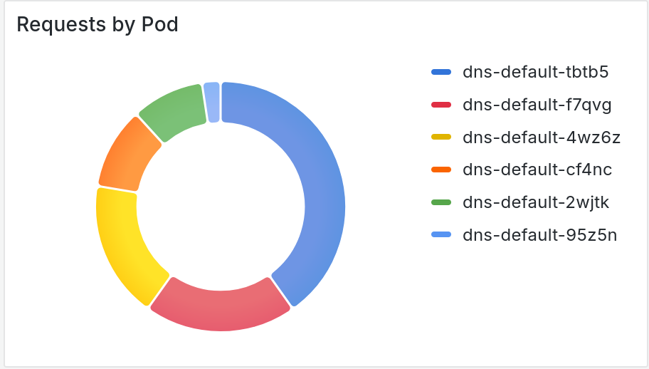
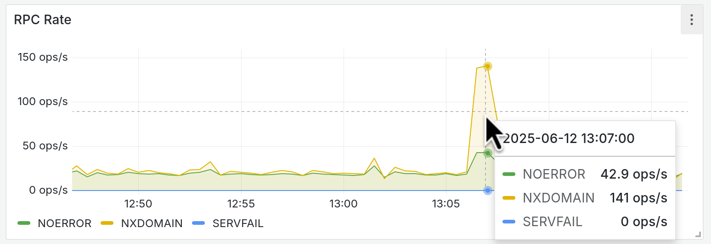
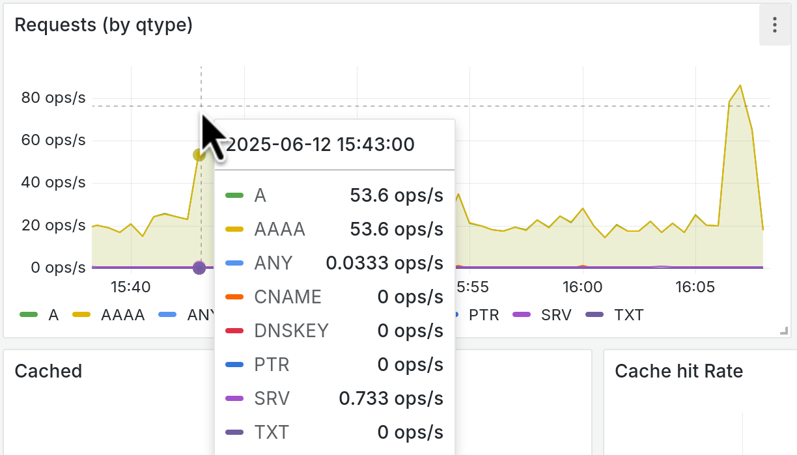

This post is born out of a real-world experience. While deploying a CoreDNS dashboard in Grafana to monitor OpenShift DNS servers, I discovered several quirks that not only impact performance but also explain some puzzling application behaviors driven by Java’s DNS implementation. Let’s dive in.

# DNS Service Discovery in Kubernetes

To understand the basics of what is DNS and his invention, I recommend [an interview with Paul Mockapetris](https://www.youtube.com/watch?v=MJBVELNKBjM). This post focuses on how it is implemented in Kubernetes/OpenShift and how Java resolution interacts.

Kubernetes typically uses [CoreDNS](https://coredns.io/) as its internal cluster DNS server, which OpenShift also adopts. CoreDNS is configured to query the Kubernetes API server for service discovery, following the [DNS-based service discovery specification](https://github.com/kubernetes/dns/blob/master/docs/specification.md).

There are two common service types:

- **ClusterIP Service:**  
  A single IP is assigned to the service (e.g., `my-service.namespace.svc.cluster.local`). The balancing among backend pods happens at the network level.
  
- **Headless Service:**  
  No ClusterIP is assigned. A DNS query for `my-service.namespace.svc.cluster.local` returns all pod IPs. This is especially useful for StatefulSets where clients need to distinguish between individual endpoints (e.g., `pod-0.my-service.namespace.svc.cluster.local`).

# OpenShift, OVN and DNS implementation

In OpenShift, CoreDNS instances run as multiple replicas behind a single, fixed service IP (usually `172.30.0.10`), which is automatically injected into pods’ `/etc/resolv.conf`. Although this service uses round-robin load balancing, it can be more efficient if a DNS query goes to a local DNS server. To achieve this, Red Hat engineers implemented a [custom OVN rule in the OVN-Kubernetes plugin]((https://github.com/openshift/ovn-kubernetes/blob/release-4.18/go-controller/pkg/ovn/controller/services/lb_config.go#L251-L253)) that redirects DNS queries to a local instance when possible.

I deployed my grafana dashboard in my 6 node OpenShift cluster, and deployed a springboot application stick to a node (with nodeselector) to do some quick tests and double check the node DNS request stickiness.

 

That seems to be as expected an uneven distribution of DNS queries depending on the applications in that node, but looking at other panels in the dashboard fired my curiosity.


# Search domain, ndots and multiple requests

DNS resolution in pods is enhanced by the `search` directive in `/etc/resolv.conf`. For example, a configuration like this:

```bash
search namespace.svc.cluster.local svc.cluster.local cluster.local
```

instructs the resolver to try appending these suffixes to unqualified names. When a client queries for `my-service`, it sequentially tries:

1. `my-service.namespace.svc.cluster.local`
2. `my-service.svc.cluster.local`
3. `my-service.cluster.local`

The `ndots` option determines whether the resolver should treat the name as fully qualified. In OpenShift, the default is typically 5. Since `my-service.namespace.svc.cluster.local` contains 4 dots, it will go through the search list. Adding a trailing dot (e.g., `my-service.namespace.svc.cluster.local.`) tells the resolver to use the name as is.

When looking at the metrics of query results, we can see lots of NOERROR responses.

. 

- When querying a fully qualified name like `my-service.namespace.svc.cluster.local`, the search configuration causes the resolver to append additional, non-existent suffixes. For example, it might eventually try `my-service.namespace.svc.cluster.local.namespace.svc.cluster.local` and similar combinations, each returning a NOERROR (meaning “name not found”) response.
- Using a trailing dot or modifying the `ndots` setting can prevent these redundant lookups.

# Multiple A/AAAA Record Requests

When Java applications (e.g., those using JDBC, JMS, or Kafka) rely on DNS, they use the internal `InetAddress` class to resolve hostnames. By default, Java resolves both IPv4 (A records) and IPv6 (AAAA records). Two system properties control this behavior:

- `java.net.preferIPv4Stack`: If set to `true`, only A records are requested.
- `java.net.preferIPv6Addresses`: When `false`, both record types are requested, although it only controls the preference order.

That explains the metrics from my type of requests.



In a cluster where only IPv4 is used, setting `java.net.preferIPv4Stack=true` can cut in half the number of DNS queries submitted to CoreDNS.

> **More info:** The [InetAddress implementation](https://github.com/openjdk/jdk/blob/jdk-21-ga/src/java.base/share/classes/java/net/InetAddress.java) for any internal details. Particularly, the code for [ipv4/ipv6 query logic](https://github.com/openjdk/jdk/blob/jdk-21-ga/src/java.base/share/classes/java/net/InetAddress.java#L395-L427).

> **More info:** The [Complete Java Networking properties documentation](https://docs.oracle.com/en/java/javase/21/docs/api/java.base/java/net/doc-files/net-properties.html) explains these properties and also the cache security ones.

### DNS Caching and Headless Services

Java caches DNS responses to reduce lookup overhead. This caching behavior is controlled by properties such as:

- `networkaddress.cache.ttl`
- `networkaddress.cache.stale.ttl`
- `networkaddress.cache.negative.ttl`

For stable ClusterIP services, caching is beneficial since the service IP remains constant. However, headless services dynamically return a list of pod IPs that may change as replicas are added or removed. In dynamic scaling scenarios, a stale cache can cause a Java application to use an outdated list of endpoints. Setting the TTL values to zero (i.e., disabling caching) and ensuring persistent connections can help maintain up-to-date resolution and keep DNS request to a reasonable value.

> **More info:** Official Documentation of [these properties](https://docs.oracle.com/en/java/javase/21/docs/api/java.base/java/net/doc-files/net-properties) 

## Key Takeaways

- **Understand Your Service Types:**  
  ClusterIP services provide a stable single IP, while headless services deliver a list of endpoints, leading to client-side load balancing.
  
- **Tweak Resolver Settings:**  
  Adjusting the `search` and `ndots` parameters—or appending a trailing dot—can prevent unnecessary DNS lookups.
  
- **Adjust Java DNS Behavior:**  
  In an IPv4 environment, configuring `java.net.preferIPv4Stack=true` reduces extraneous AAAA queries.
  
- **Manage DNS Caching in Dynamic Environments:**  
  For headless services, fine-tuning or disabling Java’s DNS caching can help tackle rapid changes in service endpoints.

